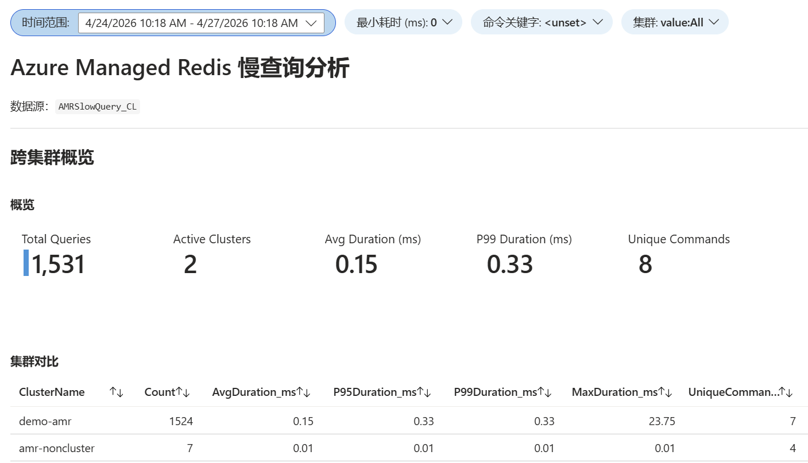
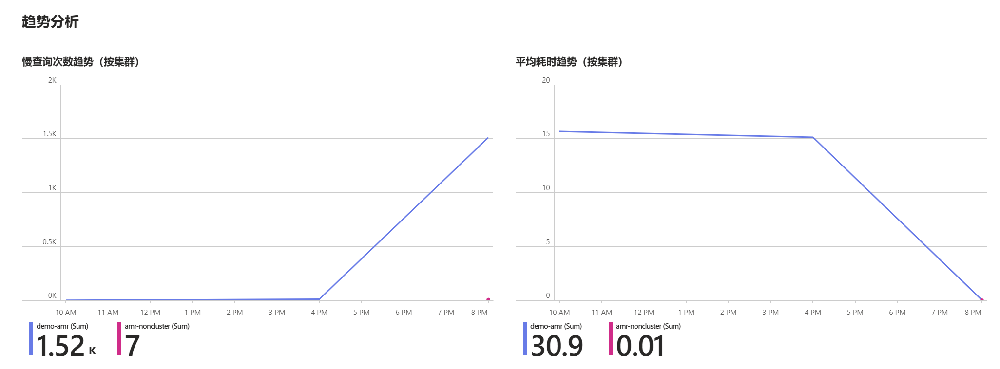
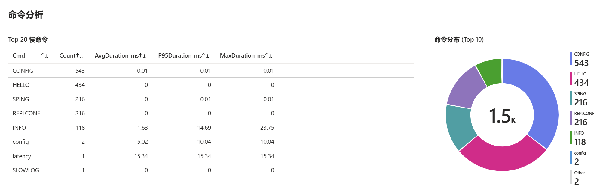
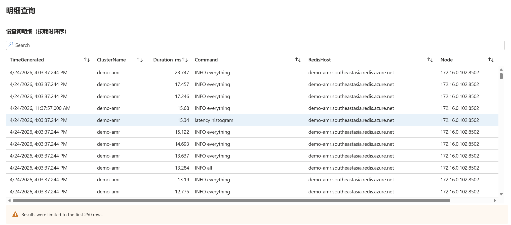

# Azure Managed Redis 慢查询日志分析方案

## 概述

本方案为 Azure Managed Redis（AMR）提供完整的慢查询日志采集、存储与可视化分析能力。支持同时监控多个 AMR 集群，通过轻量级 Exporter 服务定期从 Redis 实例拉取慢查询日志，上报至 Azure Monitor Log Analytics，并配套 Azure Monitor Workbook 实现跨集群的多维度查询与统计分析。

---

## 效果示例

**跨集群概览** — KPI 指标卡 + 集群对比表



**趋势分析** — 慢查询次数与平均耗时并排时序图



**命令分析** — Top 20 慢命令表格与命令分布饼图



**明细查询** — 全量明细，支持列筛选，按耗时降序



---

## 架构

```
┌─────────────────────────────────────────────────────────────────────┐
│  AKS 集群  namespace: amr-exporter                                  │
│                                                                     │
│  StatefulSet: amr-slowquery-exporter (replicas = 集群数量)          │
│  ┌──────────────────────┐  ┌──────────────────────┐                 │
│  │  Pod-0               │  │  Pod-1               │  ...            │
│  │  → clusters.json[0]  │  │  → clusters.json[1]  │                 │
│  │  ClusterName=prod-a  │  │  ClusterName=prod-b  │                 │
│  │  PVC: data-...-0     │  │  PVC: data-...-1     │                 │
│  └──────────┬───────────┘  └──────────┬───────────┘                 │
└─────────────┼─────────────────────────┼─────────────────────────────┘
              │  Workload Identity      │                     
              └──────────────┬──────────┘
                             │
             ┌───────────────▼───────────────────────┐
             │  Azure Monitor                        │
             │  DCE → DCR → Log Analytics Workspace  │
             │    └─► AMRSlowQuery_CL                │
             │          (ClusterName 字段区分来源)   │
             └───────────────────────────────────────┘
                             │
             ┌───────────────▼──────────────────────────┐
             │  Azure Monitor Workbook                  │
             │  参数：时间范围 / 集群 / 最小耗时 / 命令 │
             └──────────────────────────────────────────┘
```

---

## 多集群管理方式

使用 Kubernetes **StatefulSet** 统一管理所有集群的 Exporter 实例。每个 Pod 在启动时通过 Downward API 获取自身名称（`amr-slowquery-exporter-0`、`-1`……），解析末尾序号，从 `clusters.json` 中索引对应集群的连接参数。

```
amr-clusters-config (Secret)
  └─ clusters.json → JSON 数组
        [0]  cluster-a  ← Pod-0 读取
        [1]  cluster-b  ← Pod-1 读取
        [2]  cluster-c  ← Pod-2 读取
```

**新增集群**：在 `clusters.json` 末尾追加一个对象，`replicas + 1`。  
**移除集群**：删除 `clusters.json` 最后一个对象，`replicas - 1`（StatefulSet 从最高序号缩容）。  
**修改集群配置**：直接编辑 `clusters.json` 对应项，`kubectl rollout restart` 使其生效。

---

## 组件说明

### Exporter 服务（`exporter.py`）

| 项目 | 说明 |
|---|---|
| 运行方式 | StatefulSet，一个 Pod 对应一个 AMR 集群 |
| 轮询间隔 | 可在 clusters.json 中按集群配置，默认 60 秒 |
| Redis 认证 | Access Key（存于 `amr-clusters-config` Secret） |
| 集群模式 | OSS / Enterprise 均支持，按集群独立配置 |
| 去重机制 | 持久化记录每个分片的 `last_id`，重启不重复上报 |
| 本地备份 | 追加写入 Pod 独立 PVC 上的 JSONL 文件 |
| 多集群标识 | `clusters.json` 中的 `AMR_CLUSTER_NAME` 写入每条日志 |

**启动流程**：
1. Pod 读取 `POD_NAME` 环境变量（Downward API 注入）
2. 解析末尾序号，加载 `clusters.json[ordinal]` 中的集群参数
3. 覆盖全局配置变量后正常启动轮询循环

**OSS 集群模式**：Exporter 遍历所有主分片逐一查询 SLOWLOG，按 `host:port` 分别记录 `last_id`，保证完整采集。

### 数据存储（Log Analytics `AMRSlowQuery_CL`）

| 字段 | 类型 | 说明 |
|---|---|---|
| `TimeGenerated` | datetime | 慢查询发生时间（UTC） |
| `SlowlogId` | int | Redis SLOWLOG 序号 |
| `Duration_us` | long | 执行耗时（微秒） |
| `Duration_ms` | real | 执行耗时（毫秒） |
| `Command` | string | 完整命令字符串 |
| `RedisHost` | string | Redis 实例主机名 |
| `ClusterName` | string | 集群友好名称（由 `AMR_CLUSTER_NAME` 设置） |
| `Node` | string | 分片节点（OSS 模式） |
| `ExportedAt` | datetime | 条目被采集上报的时间 |

### Workbook（`AMR 慢查询分析`）

支持**时间范围、集群、最小耗时、命令关键字**四个参数动态过滤，集群下拉框动态查询已接入的 `ClusterName` 值，默认展示所有集群聚合数据。

| 视图 | 说明 |
|---|---|
| 概览 KPI | 查询总数、平均耗时、P99 耗时、命令种类 |
| 趋势分析 | 慢查询次数与平均耗时随时间变化趋势 |
| Top 20 慢命令 | 按次数排序，含 Avg/P95/Max 耗时，热力色阶 |
| 命令分布 | Top 10 命令占比饼图 |
| 耗时分布 | 6 个耗时区间柱状图（<10ms ~ >1s） |
| 分片分布 | 各 Redis 分片慢查询次数与平均耗时 |
| 明细查询 | 全量明细表格，支持列筛选，按耗时降序 |

---

## 认证与安全

| 连接目标 | 认证方式 | 说明 |
|---|---|---|
| Azure Managed Redis | Access Key | 存于 `amr-clusters-config` Secret，按集群独立 |
| Azure Monitor（Log Analytics） | AKS Workload Identity | 所有 Pod 共用同一 UAMI，零密钥管理 |

---

## 部署文件结构

```
k8s/
├── base/
│   ├── kustomization.yaml
│   ├── serviceaccount.yaml   # UAMI client-id 注解
│   ├── service.yaml          # StatefulSet 必需的 headless Service
│   └── statefulset.yaml      # 公共 Pod 模板
└── overlays/
    └── demo/
        ├── kustomization.yaml       # namespace + patches
        ├── namespace.yaml
        ├── shared-secret.yaml       # DCE_ENDPOINT, DCR_RULE_ID
        ├── clusters-config.yaml     # clusters.json（含各集群 host/key）
        └── replicas-patch.yaml      # replicas = 集群数量
```

单集群快速部署可直接使用根目录的 `k8s.yaml`（all-in-one）。

---

## 文件清单

| 文件 | 用途 |
|---|---|
| `exporter.py` | 慢查询采集与上报服务主程序 |
| `requirements.txt` | Python 依赖 |
| `Dockerfile` | 容器镜像构建文件 |
| `k8s.yaml` | 单集群 all-in-one 部署参考 |
| `k8s/base/` | Kustomize base（公共资源） |
| `k8s/overlays/prod/` | Kustomize overlay（环境配置 + 集群列表） |
| `dcr-rule.json` | DCR 流声明配置 |
| `deploy-workbook.py` | Workbook 部署脚本 |
