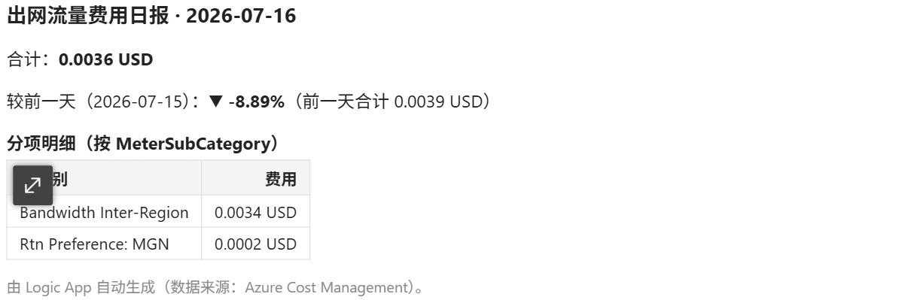

# 每日出网流量费用日报 · 部署手册（Azure CLI 版）

本文提供 **Logic App（低代码）+ ACS 邮件** 方案的完整部署步骤，所有资源均使用 **Azure CLI** 创建（不使用 Bicep/ARM 建资源）。

可视化工作流，无需写代码、无需邮箱账号：每天拉取前一天出网费用，计算环比差异并按
`MeterSubCategory` 生成明细表，通过 **ACS（Azure Communication Services）Email** 连接器发信，
靠**系统托管标识**查成本。

---

## 0. 公共前置

```bash
# 登录并选择订阅
az login
az account set --subscription <SUBSCRIPTION_ID>

# 公共变量（按需修改）
SUB=$(az account show --query id -o tsv)
RG=rg-egress-cost-daily
LOCATION=southeastasia
METER_CATEGORY=Bandwidth          # 出网流量归属的计费类别
RECIPIENTS="you@example.com"      # 收件人邮箱，多个用分号(;)分隔（在 2.2 填入 LA_RECIPIENTS）

# 创建资源组
az group create -n $RG -l $LOCATION
```

> 需要的 CLI 扩展（首次执行会自动提示安装，也可手动装）：
> ```bash
> az extension add --name communication   # ACS
> az extension add --name logic           # Logic App workflow
> ```

---

## 1. 创建 ACS 邮件资源

ACS 邮件由 3 个资源组成：Email Service → 托管发件域（AzureManagedDomain）→ Communication Service（关联发件域）。
Email 服务用 `az resource create` 创建；发件域用 `az communication email domain` 专用命令；Communication Service 用 `az communication create`。

```bash
ACS_NAME=egresscost-acs
EMAIL_SVC=egresscost-email
DATA_LOCATION="United States"     # ACS 数据驻留地

# 1a. Email Communication Service（location 固定 global）
az resource create \
  -g $RG --name $EMAIL_SVC \
  --resource-type Microsoft.Communication/emailServices \
  --api-version 2023-04-01 \
  --location global \
  --properties "{\"dataLocation\":\"$DATA_LOCATION\"}"

# 1b. Azure 托管发件域（用 ACS 专用命令；az resource create 对该子资源类型解析会报错）
az communication email domain create \
  -g $RG --email-service-name $EMAIL_SVC \
  --name AzureManagedDomain --location global \
  --domain-management AzureManaged --user-engmnt-tracking Disabled

# 取回发件域，拼出发件地址
SENDER_DOMAIN=$(az communication email domain show \
  -g $RG --email-service-name $EMAIL_SVC --name AzureManagedDomain \
  --query fromSenderDomain -o tsv)
EMAIL_SENDER="DoNotReply@${SENDER_DOMAIN}"
echo "发件人: $EMAIL_SENDER"

DOMAIN_ID=$(az communication email domain show \
  -g $RG --email-service-name $EMAIL_SVC --name AzureManagedDomain \
  --query id -o tsv)

# 1c. Communication Service，并关联发件域
az communication create \
  -g $RG --name $ACS_NAME \
  --location global --data-location "$DATA_LOCATION"

az resource update \
  -g $RG --name $ACS_NAME \
  --resource-type Microsoft.Communication/communicationServices \
  --api-version 2023-04-01 \
  --set properties.linkedDomains="['$DOMAIN_ID']"

# 取回 ACS 连接字符串（发邮件用）
ACS_CONN=$(az communication list-key -g $RG --name $ACS_NAME \
  --query primaryConnectionString -o tsv)
```

> **发件域与收件人从哪来？**
> - **发件人 `$EMAIL_SENDER`**：由步骤 1b 查询托管发件域 `fromSenderDomain` 自动拼成
>   `DoNotReply@<发件域>.azurecomm.net`，无需手填。若已部署过 ACS，可单独查回：
>   ```bash
>   az communication email domain show -g $RG \
>     --email-service-name $EMAIL_SVC --name AzureManagedDomain \
>     --query fromSenderDomain -o tsv
>   ```
> - **收件人**：在下方 2.2 的 `LA_RECIPIENTS` 填真实邮箱，多个用**分号 `;`** 分隔。

---

## 2. Logic App 工作流部署

Logic App 工作流本身是一段 JSON 定义（本仓库 `azuredeploy.json` 内含）。这里用 **az cli** 建资源：
先建 `acsemail` API 连接，再用 `az logic workflow create` 建工作流。

该工作流每天拉取「前一天」出网费用，并额外产出：
- **分项明细**：按 `MeterSubCategory` 分组，拼成 HTML 表格；
- **环比差异**：与「前两天」合计对比，计算百分比升降（`▲ +x%` / `▼ -x%`）。
共 3 个成本查询（昨日明细 / 昨日合计 / 前天合计），HTTP 动作已配置指数退避重试以应对 Cost API 429 限流。

## 2.1 创建 ACS Email API 连接（`acsemail`，密钥，无需邮箱账号）

```bash
CONN_NAME=egress-cost-logic-acsemail
API_ID="/subscriptions/$SUB/providers/Microsoft.Web/locations/$LOCATION/managedApis/acsemail"

az resource create \
  -g $RG --name $CONN_NAME \
  --resource-type Microsoft.Web/connections \
  --api-version 2016-06-01 \
  --location $LOCATION \
  --properties "{\"displayName\":\"acsemail\",\"api\":{\"id\":\"$API_ID\"},\"parameterValues\":{\"api_key\":\"$ACS_CONN\"}}"

CONN_ID=$(az resource show -g $RG --name $CONN_NAME \
  --resource-type Microsoft.Web/connections --api-version 2016-06-01 --query id -o tsv)
```

## 2.2 生成工作流定义文件

Logic App 收件人用**分号**分隔。用下面命令生成一份 `workflow-def.json`（工作流定义 + `$connections` 绑定）：

```bash
LOGIC_APP=egress-cost-logic
LA_RECIPIENTS="you@example.com"          # 多个用分号(;)分隔

cat > /tmp/workflow-def.json <<JSON
{
  "definition": {
    "\$schema": "https://schema.management.azure.com/providers/Microsoft.Logic/schemas/2016-06-01/workflowdefinition.json#",
    "contentVersion": "1.0.0.0",
    "parameters": {
      "\$connections": {
        "type": "Object",
        "defaultValue": {}
      },
      "sender": {
        "type": "String",
        "defaultValue": "$EMAIL_SENDER"
      },
      "recipients": {
        "type": "String",
        "defaultValue": "$LA_RECIPIENTS"
      }
    },
    "triggers": {
      "Recurrence": {
        "type": "Recurrence",
        "recurrence": {
          "frequency": "Day",
          "interval": 1,
          "timeZone": "UTC",
          "schedule": {
            "hours": [
              2
            ],
            "minutes": [
              0
            ]
          }
        }
      }
    },
    "actions": {
      "Query_detail": {
        "type": "Http",
        "inputs": {
          "method": "POST",
          "uri": "https://management.azure.com/subscriptions/$SUB/providers/Microsoft.CostManagement/query?api-version=2023-11-01",
          "authentication": {
            "type": "ManagedServiceIdentity",
            "audience": "https://management.azure.com/"
          },
          "body": {
            "type": "ActualCost",
            "timeframe": "Custom",
            "timePeriod": {
              "from": "@{formatDateTime(addDays(utcNow(), -1), 'yyyy-MM-ddT00:00:00Z')}",
              "to": "@{formatDateTime(addDays(utcNow(), -1), 'yyyy-MM-ddT23:59:59Z')}"
            },
            "dataset": {
              "granularity": "None",
              "aggregation": {
                "totalCost": {
                  "name": "PreTaxCost",
                  "function": "Sum"
                }
              },
              "filter": {
                "dimensions": {
                  "name": "MeterCategory",
                  "operator": "In",
                  "values": [
                    "$METER_CATEGORY"
                  ]
                }
              },
              "grouping": [
                {
                  "type": "Dimension",
                  "name": "MeterSubCategory"
                }
              ]
            }
          },
          "retryPolicy": {
            "type": "exponential",
            "count": 4,
            "interval": "PT20S"
          }
        }
      },
      "Query_yesterday_total": {
        "type": "Http",
        "inputs": {
          "method": "POST",
          "uri": "https://management.azure.com/subscriptions/$SUB/providers/Microsoft.CostManagement/query?api-version=2023-11-01",
          "authentication": {
            "type": "ManagedServiceIdentity",
            "audience": "https://management.azure.com/"
          },
          "body": {
            "type": "ActualCost",
            "timeframe": "Custom",
            "timePeriod": {
              "from": "@{formatDateTime(addDays(utcNow(), -1), 'yyyy-MM-ddT00:00:00Z')}",
              "to": "@{formatDateTime(addDays(utcNow(), -1), 'yyyy-MM-ddT23:59:59Z')}"
            },
            "dataset": {
              "granularity": "None",
              "aggregation": {
                "totalCost": {
                  "name": "PreTaxCost",
                  "function": "Sum"
                }
              },
              "filter": {
                "dimensions": {
                  "name": "MeterCategory",
                  "operator": "In",
                  "values": [
                    "$METER_CATEGORY"
                  ]
                }
              }
            }
          },
          "retryPolicy": {
            "type": "exponential",
            "count": 4,
            "interval": "PT20S"
          }
        },
        "runAfter": {
          "Query_detail": [
            "Succeeded"
          ]
        }
      },
      "Query_prev_total": {
        "type": "Http",
        "inputs": {
          "method": "POST",
          "uri": "https://management.azure.com/subscriptions/$SUB/providers/Microsoft.CostManagement/query?api-version=2023-11-01",
          "authentication": {
            "type": "ManagedServiceIdentity",
            "audience": "https://management.azure.com/"
          },
          "body": {
            "type": "ActualCost",
            "timeframe": "Custom",
            "timePeriod": {
              "from": "@{formatDateTime(addDays(utcNow(), -2), 'yyyy-MM-ddT00:00:00Z')}",
              "to": "@{formatDateTime(addDays(utcNow(), -2), 'yyyy-MM-ddT23:59:59Z')}"
            },
            "dataset": {
              "granularity": "None",
              "aggregation": {
                "totalCost": {
                  "name": "PreTaxCost",
                  "function": "Sum"
                }
              },
              "filter": {
                "dimensions": {
                  "name": "MeterCategory",
                  "operator": "In",
                  "values": [
                    "$METER_CATEGORY"
                  ]
                }
              }
            }
          },
          "retryPolicy": {
            "type": "exponential",
            "count": 4,
            "interval": "PT20S"
          }
        },
        "runAfter": {
          "Query_yesterday_total": [
            "Succeeded"
          ]
        }
      },
      "Compose_total": {
        "type": "Compose",
        "runAfter": {
          "Query_prev_total": [
            "Succeeded"
          ]
        },
        "inputs": "@if(greater(length(coalesce(body('Query_yesterday_total')?['properties']?['rows'],json('[]'))),0),float(first(coalesce(body('Query_yesterday_total')?['properties']?['rows'],json('[]')))?[0]),0)"
      },
      "Compose_currency": {
        "type": "Compose",
        "runAfter": {
          "Compose_total": [
            "Succeeded"
          ]
        },
        "inputs": "@if(greater(length(coalesce(body('Query_yesterday_total')?['properties']?['rows'],json('[]'))),0),coalesce(first(coalesce(body('Query_yesterday_total')?['properties']?['rows'],json('[]')))?[1],'USD'),'USD')"
      },
      "Compose_prev": {
        "type": "Compose",
        "runAfter": {
          "Compose_currency": [
            "Succeeded"
          ]
        },
        "inputs": "@if(greater(length(coalesce(body('Query_prev_total')?['properties']?['rows'],json('[]'))),0),float(first(coalesce(body('Query_prev_total')?['properties']?['rows'],json('[]')))?[0]),0)"
      },
      "Compose_pctnum": {
        "type": "Compose",
        "runAfter": {
          "Compose_prev": [
            "Succeeded"
          ]
        },
        "inputs": "@mul(div(sub(outputs('Compose_total'),outputs('Compose_prev')),if(equals(outputs('Compose_prev'),0),1,outputs('Compose_prev'))),100)"
      },
      "Compose_pct_text": {
        "type": "Compose",
        "runAfter": {
          "Compose_pctnum": [
            "Succeeded"
          ]
        },
        "inputs": "@if(equals(outputs('Compose_prev'),0),if(equals(outputs('Compose_total'),0),'0.00%（与前一天持平，均为 0）','—（前一天无费用，无法计算百分比）'),concat(if(greaterOrEquals(outputs('Compose_pctnum'),0),'▲ +','▼ -'),formatNumber(if(greaterOrEquals(outputs('Compose_pctnum'),0),outputs('Compose_pctnum'),mul(outputs('Compose_pctnum'),-1)),'F2'),'%'))"
      },
      "Select_rows": {
        "type": "Select",
        "runAfter": {
          "Compose_pct_text": [
            "Succeeded"
          ]
        },
        "inputs": {
          "from": "@coalesce(body('Query_detail')?['properties']?['rows'],json('[]'))",
          "select": "@concat('<tr><td style=\"padding:4px 10px;border:1px solid #ddd\">',string(item()?[1]),'</td><td style=\"padding:4px 10px;border:1px solid #ddd;text-align:right\">',formatNumber(float(item()?[0]),'F4'),' ',string(item()?[2]),'</td></tr>')"
        }
      },
      "Compose_table": {
        "type": "Compose",
        "runAfter": {
          "Select_rows": [
            "Succeeded"
          ]
        },
        "inputs": "@if(greater(length(coalesce(body('Query_detail')?['properties']?['rows'],json('[]'))),0),concat('<table style=\"border-collapse:collapse;font-size:13px;margin:4px 0\"><thead><tr><th style=\"padding:4px 10px;border:1px solid #ddd;text-align:left;background:#f4f4f4\">子类别</th><th style=\"padding:4px 10px;border:1px solid #ddd;text-align:right;background:#f4f4f4\">费用</th></tr></thead><tbody>',join(body('Select_rows'),''),'</tbody></table>'),'<p style=\"color:#888\">（前一天无出网费用明细）</p>')"
      },
      "Select_recipients": {
        "type": "Select",
        "runAfter": {
          "Compose_table": [
            "Succeeded"
          ]
        },
        "inputs": {
          "from": "@split(parameters('recipients'), ';')",
          "select": {
            "address": "@trim(item())"
          }
        }
      },
      "Send_email": {
        "type": "ApiConnection",
        "runAfter": {
          "Select_recipients": [
            "Succeeded"
          ]
        },
        "inputs": {
          "host": {
            "connection": {
              "name": "@parameters('\$connections')['acsemail']['connectionId']"
            }
          },
          "method": "post",
          "path": "/emails:sendGAVersion",
          "queries": {
            "api-version": "2023-03-31"
          },
          "body": {
            "senderAddress": "@parameters('sender')",
            "recipients": {
              "to": "@body('Select_recipients')"
            },
            "content": {
              "subject": "@{concat('[出网费用] ',formatDateTime(addDays(utcNow(),-1),'yyyy-MM-dd'),' 合计 ',formatNumber(outputs('Compose_total'),'F4'),' ',outputs('Compose_currency'),'（较前一天 ',outputs('Compose_pct_text'),'）')}",
              "html": "@concat('<div style=\"font-family:Segoe UI,Arial,sans-serif;font-size:14px;color:#222\">','<h3 style=\"margin:0 0 8px\">出网流量费用日报 · ',formatDateTime(addDays(utcNow(),-1),'yyyy-MM-dd'),'</h3>','<p>合计：<b>',formatNumber(outputs('Compose_total'),'F4'),' ',outputs('Compose_currency'),'</b></p>','<p>较前一天（',formatDateTime(addDays(utcNow(),-2),'yyyy-MM-dd'),'）：<b>',outputs('Compose_pct_text'),'</b>（前一天合计 ',formatNumber(outputs('Compose_prev'),'F4'),' ',outputs('Compose_currency'),'）</p>','<h4 style=\"margin:12px 0 4px\">分项明细（按 MeterSubCategory）</h4>',outputs('Compose_table'),'<p style=\"color:#888;font-size:12px;margin-top:12px\">由 Logic App 自动生成（数据来源：Azure Cost Management）。</p>','</div>')"
            },
            "importance": "Normal"
          }
        }
      }
    },
    "outputs": {}
  },
  "parameters": {
    "\$connections": {
      "value": {
        "acsemail": {
          "connectionId": "$CONN_ID",
          "connectionName": "$CONN_NAME",
          "id": "$API_ID"
        }
      }
    }
  }
}
JSON
```

> `api-version=2023-03-31` 是 `Send_email` 必需的查询参数；缺失会导致连接器返回 `404 Resource not found`。

## 2.3 创建 Logic App 工作流（az cli）

`az logic workflow create` 的 `--definition` 需要**完整的工作流属性对象**（即包含 `definition`
与 `parameters` 两个键，正是 2.2 生成的 `workflow-def.json`），并用 `--mi-system-assigned true`
一并开启系统托管标识（该命令没有独立的 `--parameters` 参数）：

```bash
az logic workflow create \
  -g $RG --name $LOGIC_APP --location $LOCATION \
  --mi-system-assigned true \
  --definition @/tmp/workflow-def.json
```

## 2.4 授予托管标识查成本的角色

```bash
LA_PRINCIPAL=$(az resource show -g $RG --name $LOGIC_APP \
  --resource-type Microsoft.Logic/workflows --api-version 2019-05-01 \
  --query identity.principalId -o tsv)

az role assignment create \
  --assignee-object-id $LA_PRINCIPAL \
  --assignee-principal-type ServicePrincipal \
  --role "Cost Management Reader" \
  --scope "/subscriptions/$SUB"
```

## 2.5 手动触发验证（Recurrence 触发器）

```bash
# 手动触发一次（Recurrence 触发器用 run API）
az rest --method post --url \
  "https://management.azure.com/subscriptions/$SUB/resourceGroups/$RG/providers/Microsoft.Logic/workflows/$LOGIC_APP/triggers/Recurrence/run?api-version=2019-05-01"

# 查看最近一次运行状态
az rest --method get --url \
  "https://management.azure.com/subscriptions/$SUB/resourceGroups/$RG/providers/Microsoft.Logic/workflows/$LOGIC_APP/runs?api-version=2019-05-01&\$top=1" \
  --query "value[0].properties.status" -o tsv
```

工作流每天 **UTC 02:00** 自动运行：查前一天出网费用 → 计算真实金额 → 通过 ACS Email 发信。

验证成功后收到的日报邮件效果如下（含合计、环比差异、分项明细表）：



---

## 常见问题与要点

- **Cost Management 限流（429）**：反复手动测试易触发限流；工作流的 3 个 HTTP 查询已配置指数退避重试（`count=4, PT20S`）。生产每天仅触发 1 次，无碍。
- **ACS 邮件连接器 404**：`Send_email` 必须带 `api-version=2023-03-31` 查询参数（模板已含）。
- **环比除零保护**：前一天费用为 0 时显示「无法计算百分比」，不会报错。
- **出网口径**：Azure 出网流量计费归属 `MeterCategory=Bandwidth`；如需更细口径可改用 `MeterSubCategory` 过滤或调整 `meterCategory`。
- **成本数据延迟**：Cost Management 数据通常有数小时延迟，02:00 拉前一天数据可覆盖。
- **角色分配权限**：`az role assignment create` 需执行者具备 `Microsoft.Authorization/roleAssignments/write`（订阅 Owner / User Access Administrator）。
