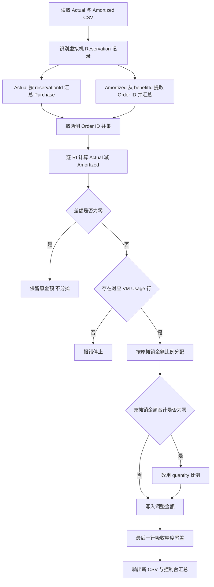

# RI 实际与摊销账单差额分摊说明

> **文档元数据**
>
> - 飞书文档（导出目标）：<https://my.feishu.cn/docx/T4gAdVDH3o7CcBxDiPgcyOsrnqK>
> - 说明：本 Markdown 为权威源文件；后续如需同步/导出到飞书，请更新上述飞书文档。
> - 最后导出到飞书：2026-08-13

## 1. 目的

Azure Actual 成本导出与 Amortized 成本导出采用不同的 RI 记账方式：

- Actual 账单通常在 RI Purchase 发生时记录购买金额。
- Amortized 账单将 RI 成本分配到具体使用日期和资源，并可能包含 `UnusedReservation`。

因此，即使按量费用完全一致，同一账期的 Actual 与 Amortized 总金额仍可能存在差异。本脚本用于：

1. 按 Reservation Order ID 汇总每个虚拟机 RI 的 Actual 金额。
2. 汇总同一 RI 在 Amortized 账单中的已有摊销金额。
3. 计算 Actual 与 Amortized 的 RI 差额。
4. 将差额按比例分配到实际使用该 RI 的虚拟机 Usage 行。
5. 输出带有调整金额和调整后金额的新 CSV 文件。

以下原始字段保持不变：

- `costInBillingCurrency`、`costInPricingCurrency`、`costInUsd` 等 Azure 原始金额字段
- `tags`
- `ResourceId`
- `pricingModel`
- `reservationId` 与 `benefitId`

## 2. 支持范围与记录识别

### 2.1 当前支持范围

当前脚本只处理虚拟机 RI：

```text
pricingModel = Reservation
meterCategory = Virtual Machines
```

SQL Database、Cosmos DB、Synapse、App Service 等其他服务的预留不会参与本脚本的差额计算和分摊。

### 2.2 Actual 账单中的 RI 金额

同时满足以下条件的记录被识别为虚拟机 RI Purchase：

```text
pricingModel = Reservation
meterCategory = Virtual Machines
chargeType = Purchase
```

Actual 侧直接使用 `reservationId` 作为 Reservation Order ID，并按 Order ID 汇总命令行指定的金额字段。

### 2.3 Amortized 账单中的 RI 金额

Amortized 侧从 `benefitId` 中提取：

```text
/reservationOrders/{Reservation Order ID}/
```

同一 Order ID 下所有虚拟机 Reservation 行均计入已有摊销金额，包括：

- `chargeType = Usage`
- `chargeType = UnusedReservation`

这意味着非零的 `UnusedReservation` 金额会减少后续待分摊差额，不会被重复分摊。

### 2.4 可承接差额的虚拟机行

只有同时满足以下条件的 Amortized 明细才能承接差额：

```text
pricingModel = Reservation
meterCategory = Virtual Machines
chargeType = Usage
ResourceId 包含 /virtualMachines/
Reservation Order ID 与待处理 RI 相同
```

Purchase、UnusedReservation、磁盘、网络及其他非虚拟机费用不会被作为分摊目标。

## 3. 处理流程



## 4. 差额与分摊逻辑

### 4.1 每个 RI 的待分摊总金额

脚本对 Actual 与 Amortized 中出现的 Reservation Order ID 取并集，并逐个计算：

```text
RI 待分摊金额
= Actual 中该 RI 的 Purchase 金额
− Amortized 中该 RI 的全部摊销金额
```

Amortized 全部摊销金额包含 Usage 与 UnusedReservation。

| 场景 | 差额 | 处理方式 |
|---|---:|---|
| Actual 大于 Amortized | 正数 | 按比例增加对应 VM Usage 行费用 |
| Actual 小于 Amortized | 负数 | 按比例降低对应 VM Usage 行费用 |
| Actual 等于 Amortized | 0 | 直接跳过，即使没有 VM Usage 行也不会报错 |

### 4.2 Order ID 并集

脚本不仅处理 Actual 中存在的 RI，也处理只出现在 Amortized 中的 RI：

```text
待处理 RI 集合 = Actual Order ID 集合 ∪ Amortized Order ID 集合
```

如果某个 RI 只存在于 Amortized，则 Actual 金额按 0 处理，差额为负数，并从对应虚拟机 Usage 行中按比例扣减。

### 4.3 分摊权重

默认按每条目标虚拟机行的原摊销金额比例分配：

```text
某行调整金额
= RI 待分摊金额
× 该行原摊销金额
÷ 该 RI 全部目标 VM 行原摊销金额合计
```

如果目标行原摊销金额合计为 0，则回退到 `quantity` 比例：

```text
某行调整金额
= RI 待分摊金额
× 该行 quantity
÷ 该 RI 全部目标 VM 行 quantity 合计
```

如果金额与 quantity 合计都为 0，脚本会报错，不会静默漏分。

### 4.4 精度与尾差

全部金额使用 Python `Decimal` 计算，非最后一条目标记录按 15 位小数舍入，最后一条记录吸收尾差，确保每个 RI 的调整金额之和精确等于该 RI 的待分摊金额。

### 4.5 无可承接虚拟机记录

如果差额不为 0，但同一 Order ID 下没有符合条件的虚拟机 Usage 行，脚本会报错停止：

```text
RI order ... has a difference of ..., but no corresponding VM Usage rows were found
```

脚本不会把完全未使用的 RI 成本强行分配给购买订阅中的普通虚拟机。

## 5. 未使用 RI 检测

只要 Amortized 账单中存在 `chargeType = UnusedReservation`，脚本就会在标准错误输出警告，并按 Order ID 展示：

- RI 名称
- UnusedReservation 记录数量
- 首次和最后出现日期
- 未使用数量
- 未使用金额

如果 Azure 导出的 `quantity` 与金额字段均为 0，脚本仍会提示存在 UnusedReservation，但会明确说明无法从账单量化未使用金额。

## 6. 输入参数

| 参数 | 默认值 | 说明 |
|---|---|---|
| `--actual` | `Actual_*.csv` | Actual CSV 文件或 glob，可指定多个 |
| `--amortized` | `Amortized_*.csv` | Amortized CSV 文件或 glob，可指定多个 |
| `--output-dir` | `ri_reallocated` | 新摊销账单副本的输出目录 |
| `--actual-amount-field` | `costInBillingCurrency` | Actual 账单用于汇总 Purchase 的金额字段 |
| `--amortized-amount-field` | `costInBillingCurrency` | Amortized 账单用于汇总、计算权重及生成调整后金额的字段 |

两个金额参数均支持：

```text
costInBillingCurrency
costInPricingCurrency
costInUsd
```

> **注意：** Actual 与 Amortized 的两个金额字段必须具有可比口径。脚本不会自动做汇率转换，也不会自动验证两个输入是否属于同一账期。

## 7. 输出字段

输出 CSV 在原始 Amortized 字段后新增两列：

| 字段 | 说明 |
|---|---|
| `riActualAmortizedAdjustment` | 本行分得的 Actual 与 Amortized RI 差额；正数增加费用，负数降低费用 |
| `<摊销金额字段>AfterActualReconciliation` | 原摊销金额加调整金额后的结果 |

第二列根据 `--amortized-amount-field` 动态生成：

| 摊销金额字段 | 新增调整后金额列 |
|---|---|
| `costInBillingCurrency` | `costInBillingCurrencyAfterActualReconciliation` |
| `costInPricingCurrency` | `costInPricingCurrencyAfterActualReconciliation` |
| `costInUsd` | `costInUsdAfterActualReconciliation` |

```text
调整后金额
= --amortized-amount-field 指定列的原金额
+ riActualAmortizedAdjustment
```

## 8. 执行方法

### 8.1 使用默认文件名和金额字段

```bash
python allocate_ri_difference.py
```

### 8.2 指定其他目录

```bash
python allocate_ri_difference.py \
  --actual "/data/bills/actual/Actual_*.csv" \
  --amortized "/data/bills/amortized/Amortized_*.csv" \
  --output-dir "/data/bills/output"
```

### 8.3 分别指定两类账单的金额字段

```bash
python allocate_ri_difference.py \
  --actual-amount-field costInUsd \
  --amortized-amount-field costInBillingCurrency \
  --output-dir ri_reallocated
```

### 8.4 指定多个输入

```bash
python allocate_ri_difference.py \
  --actual "/data/july/Actual_*.csv" "/data/extra/Actual_*.csv" \
  --amortized "/data/july/Amortized_*.csv" \
  --output-dir "/data/output"
```

## 9. 输出内容

输出目录中会生成与每个 Amortized 输入文件同名的新 CSV：

```text
ri_reallocated/
├── Amortized_..._part_0_0001.csv
└── Amortized_..._part_1_0001.csv
```

输出目录还会生成：

- `changed-amortized-vm-rows.csv`：所有发生调整的虚拟机费用行，包含 Reservation Order ID、日期、订阅、资源组、ResourceId、调整前金额、调整金额和调整后金额。
- `ri-allocation-summary.csv`：每个 RI 的 Actual、Amortized 和差额，以及全部 RI 的合计金额。

上述费用明细和汇总不会打印到标准输出；未使用 RI、金额权重为 0 等警告仍输出到标准错误。

## 10. 示例

### 10.1 Actual 大于 Amortized

```text
Actual RI Purchase = 100
Amortized RI Cost = 60
待分摊差额 = 40
```

若两台虚拟机的原摊销金额分别为 36 和 24，则权重为 60% 和 40%：

| 虚拟机 | 原摊销金额 | 调整金额 | 调整后金额 |
|---|---:|---:|---:|
| VM A | 36 | 24 | 60 |
| VM B | 24 | 16 | 40 |
| 合计 | 60 | 40 | 100 |

### 10.2 Actual 小于 Amortized

```text
Actual RI Purchase = 80
Amortized RI Cost = 100
待分摊差额 = -20
```

若两台虚拟机原摊销金额分别为 60 和 40，则分别调整 -12 和 -8，调整后合计为 80。

## 11. 注意事项

1. 源 CSV 不会被修改，所有结果写入新目录。
2. 脚本只处理虚拟机 RI。
3. 脚本按 Reservation Order ID 关联，不要求购买 RI 的订阅与实际使用 RI 的订阅相同。
4. 请确保 Actual 与 Amortized 输入属于需要比较的同一账期，并使用可比金额字段。
5. 脚本不会进行汇率换算。
6. Actual Purchase 的完整金额会被用于当前输入账期的对账，不会按照 `servicePeriod` 跨月拆分；该结果适用于 Actual 总额对齐，不等同于 Azure 原始摊销口径。
7. 如果不同输入目录中存在同名 Amortized CSV，输出时可能使用相同文件名，请分别指定输出目录以避免覆盖。
8. 完全未使用且差额不为 0 的 RI 没有虚拟机 Usage 行可承接，脚本会报错。
9. 本脚本处理的是 RI 实际成本与摊销成本的对齐，不计算 PAYG 原价，也不计算或分配真实 RI 优惠收益。

## 12. 与 RI 经济责任重分配配合

需要完整重分配 RI 的收益和超额成本时，本脚本必须先执行。随后将本脚本输出的
Amortized 明细交给 `reallocate_vm_ri.py`，并显式指定调整后成本字段：

```bash
python3 reallocate_vm_ri.py \
  "ri_reallocated/Amortized_*.csv" \
  --reservations-file reservations.json \
  --project-tag-key projname \
  --amount-field costInBillingCurrencyAfterActualReconciliation \
  --price-sheet-file azure-price-sheet.json \
  --output-dir ri_economic_reallocated
```

`reallocate_vm_ri.py` 将按以下口径计算有符号经济差额：

```text
RI净收益/损失
= PAYG等价成本
− costInBillingCurrencyAfterActualReconciliation
```

正数作为 RI 收益分配给绑定项目，负数作为 RI 超额成本由绑定项目承担。最终结果写入
`allocatedCostInBillingCurrency`，因此无需手工合并两个脚本的调整列。
