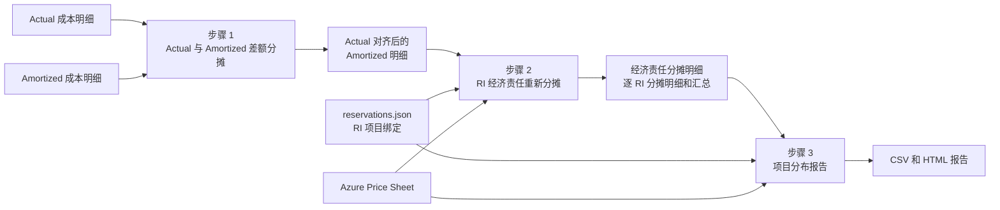

# RI 经济责任分摊流水线运行指南

## 1. 目的

本流水线依次运行两个分摊脚本和一个报告脚本：

1. `allocate_ri_difference.py`：把 Actual 与 Amortized 的 VM RI 差额分配回对应
   Amortized VM Usage 行，使 Amortized RI 成本与 Actual 账单对齐。
2. `reallocate_vm_ri.py`：以对齐后的 RI 成本为基准，计算相对 PAYG 的净收益或
   超额成本，并按 `reservations.json` 中的项目绑定重新分配经济责任。
3. `report_ri_project_distribution.py`：按每个 RI 展示分摊前后的项目经济责任分布，
   输出 CSV 和 HTML 报告。



## 2. 前置条件

在 `ri-reallocation/` 目录执行以下命令。

### 2.1 安装依赖

```bash
python3 -m pip install -r requirements.txt
```

只有显式提供本地 Price Sheet，且 `reservations.json` 不包含
`ManagementGroup` scope 时，运行过程才不需要访问 Azure API。自动下载 Price Sheet
或解析管理组 scope 前，应先登录：

```bash
az login
```

### 2.2 准备输入

建议把同一账期的输入整理为：

```text
ri-reallocation/
├── input/
│   ├── actual/
│   │   └── Actual_*.csv
│   └── amortized/
│       └── Amortized_*.csv
├── reservations.json
└── azure-price-sheet.json
```

运行前确认：

- Actual 与 Amortized 文件属于同一账期。
- 两类账单的 `costInBillingCurrency` 使用相同账单币种。
- Amortized 文件包含 `benefitId`、`reservationId`、`ResourceId`、`quantity`、
  `pricingModel`、`chargeType` 和 `meterCategory` 等脚本所需字段。
- `reservations.json` 中的 Reservation ID 与账单 `reservationId` 一致。
- 每个 binding 的 `project` 与账单中 `--project-tag-key` 对应的标签值一致。
- Price Sheet 覆盖该账期，并能按 `meterId`、日期和账单币种唯一匹配。

> 本流水线第二步只接受 `costInBillingCurrency` 或
> `costInBillingCurrencyAfterActualReconciliation`。因此第一步必须使用默认的
> `costInBillingCurrency` 口径，不能改用 `costInUsd` 或
> `costInPricingCurrency` 后再直接进入第二步。

## 3. 推荐输出目录

三个阶段使用相互独立的目录：

```text
work/
├── 01-actual-reconciled/
├── 02-economic-reallocated/
└── 03-ri-project-distribution/
```

不要把输出目录指向源文件目录。第一步和第二步都会按输入文件名生成新的账单副本，
独立目录可以避免覆盖或混用不同阶段的 CSV。

## 4. 步骤 1：对齐 Actual 与 Amortized RI 成本

执行：

```bash
python3 allocate_ri_difference.py \
  --actual "input/actual/Actual_*.csv" \
  --amortized "input/amortized/Amortized_*.csv" \
  --actual-amount-field costInBillingCurrency \
  --amortized-amount-field costInBillingCurrency \
  --output-dir work/01-actual-reconciled
```

该步骤在 Amortized 明细后追加：

| 字段 | 说明 |
|---|---|
| `riActualAmortizedAdjustment` | 本行承接的 Actual 与 Amortized RI 差额 |
| `costInBillingCurrencyAfterActualReconciliation` | 原摊销成本加差额后的成本 |

输出目录包含：

```text
work/01-actual-reconciled/
├── Amortized_*.csv
├── changed-amortized-vm-rows.csv
└── ri-allocation-summary.csv
```

- `Amortized_*.csv`：下一步骤的输入。
- `changed-amortized-vm-rows.csv`：所有发生调整的 VM Usage 行。
- `ri-allocation-summary.csv`：每个 Reservation Order 的 Actual、Amortized 和差额。

如果某个非零差额没有对应 VM Usage 行，脚本会停止。不要绕过该错误，否则无法证明
Actual 与 Amortized 差额被完整承接。

## 5. 步骤 2：重新分配 RI 经济责任

推荐显式提供同账期 Price Sheet：

```bash
python3 reallocate_vm_ri.py \
  "work/01-actual-reconciled/Amortized_*.csv" \
  --reservations-file reservations.json \
  --project-tag-key project-tag \
  --amount-field costInBillingCurrencyAfterActualReconciliation \
  --price-sheet-file azure-price-sheet.json \
  --output-dir work/02-economic-reallocated
```

此步骤按以下公式计算每条 RI Usage 的经济差额：

```text
riBenefitOrLoss
= PAYG 等价成本
− costInBillingCurrencyAfterActualReconciliation
```

- 正数表示 RI 收益，由绑定项目承接并降低目标项目费用。
- 负数表示 RI 超额成本，由绑定项目承接并增加目标项目费用。
- `riAllocationAmount` 表示每条账单明细实际增加或减少的金额。
- `allocatedCostInBillingCurrency` 是最终项目经济责任金额。

输出目录包含：

```text
work/02-economic-reallocated/
├── Amortized_*.csv
├── ri-allocation-details.csv
├── project-allocation.csv
└── ri-summary.json
```

其中：

- `Amortized_*.csv`：包含最终分摊字段的账单副本。
- `ri-allocation-details.csv`：按源账单行和 Reservation ID 拆分的调整贡献。
- `project-allocation.csv`：项目分摊前后金额汇总。
- `ri-summary.json`：RI 收益、超额成本、未使用成本及分摊范围汇总。

> 不要在流水线中使用 `--summary-only`。最终报告同时依赖分摊后账单副本和
> `ri-allocation-details.csv`。

如不提供 `--price-sheet-file`，脚本会使用当前 `az login` 身份自动下载。MCA/MPA
账单在所有行都有相同 `invoiceId` 时按发票下载；未指定 `--invoice-id` 且账单行的
`invoiceId` 不完整时，自动回退为按 Billing Profile 下载。需要强制使用指定发票时可传入：

```bash
--invoice-id "<invoice-id>" \
--billing-account-name "<billing-account-name>"
```

## 6. 步骤 3：生成 RI 项目分布报告

执行：

```bash
python3 report_ri_project_distribution.py \
  work/02-economic-reallocated \
  --project-tag-key project-tag \
  --reservations-file reservations.json \
  --price-sheet-file azure-price-sheet.json \
  --output-dir work/03-ri-project-distribution
```

`--project-tag-key` 必须与第二步一致。显式传入同一份 `reservations.json` 和 Price
Sheet，可以避免脚本从相对路径推断到错误文件；对于未被第二步计算经济差额的 RI，
报告也需要 Price Sheet 重新计算 PAYG 等价成本。

输出：

```text
work/03-ri-project-distribution/
├── ri-project-distribution.csv
└── ri-project-distribution.html
```

- CSV 每行表示一个 RI 在一个项目上的分摊前后经济责任。
- HTML 按 RI 分组展示成本、净收益或损失、项目占比和责任变化。
- 报告按 RI 校验分摊前后经济差额守恒，容差为 `1E-15`。

## 7. 完整运行示例

```bash
set -euo pipefail

python3 allocate_ri_difference.py \
  --actual "input/actual/Actual_*.csv" \
  --amortized "input/amortized/Amortized_*.csv" \
  --output-dir work/01-actual-reconciled

python3 reallocate_vm_ri.py \
  "work/01-actual-reconciled/Amortized_*.csv" \
  --reservations-file reservations.json \
  --project-tag-key project-tag \
  --amount-field costInBillingCurrencyAfterActualReconciliation \
  --price-sheet-file azure-price-sheet.json \
  --output-dir work/02-economic-reallocated

python3 report_ri_project_distribution.py \
  work/02-economic-reallocated \
  --project-tag-key project-tag \
  --reservations-file reservations.json \
  --price-sheet-file azure-price-sheet.json \
  --output-dir work/03-ri-project-distribution
```

`set -euo pipefail` 会在任一步骤失败时终止流水线，防止后续阶段读取不完整输出。

## 8. 阶段间对账

| 检查点 | 应满足的条件 |
|---|---|
| 步骤 1 | 每个 RI 的调整金额合计等于 Actual 金额减 Amortized 金额 |
| 步骤 1 | `ri-allocation-summary.csv` 合计差额与明细调整合计一致 |
| 步骤 2 | 全部输出行的 `riAllocationAmount` 合计为 0 |
| 步骤 2 | `ri-summary.json` 的 `riNetBenefitOrLoss` 等于 RI Usage 行的 `riBenefitOrLoss` 合计 |
| 步骤 3 | 每个 RI 的分摊前后净收益或损失在 `1E-15` 容差内守恒 |

三个金额字段的关系为：

```text
Actual 对齐后成本
= costInBillingCurrency
+ riActualAmortizedAdjustment

RI 净收益或损失
= PAYG 等价成本
− Actual 对齐后成本

最终项目经济责任
= Actual 对齐后成本
+ riAllocationAmount
```

## 9. 常见错误

| 错误 | 原因与处理 |
|---|---|
| 找不到 Actual 或 Amortized 输入 | 检查 glob，并为包含特殊字符或通配符的路径加引号 |
| RI 差额非零但没有 VM Usage 行 | 输入可能缺少对应 Amortized Usage；补齐账单，不要跳过 |
| 缺少 `costInBillingCurrencyAfterActualReconciliation` | 第二步误用了原始 Amortized 文件；应读取第一步输出 |
| Price Sheet 找不到唯一价格 | 检查 `meterId`、日期、币种、Consumption 类型和 tier-zero 价格 |
| 找不到目标项目接收行 | 检查项目标签、机型或灵活性组、区域及 RI scope |
| 正收益大于目标接收池费用 | 目标池不足以在不产生负费用的情况下承接收益 |
| 报告找不到 `ri-allocation-details.csv` | 第二步使用了 `--summary-only`，需要重新生成完整明细 |
| 报告提示 RI 未定义 | 将该 RI 加入 `reservations.json`；没有 binding 时可保留空列表 |

## 10. 数据安全

- `reservations.json`、原始账单、Price Sheet 和 `work/` 输出可能包含客户标识和成本
  数据，不应提交到 Git。
- 仓库已忽略 `reservations.json`、CSV 和 `realtests/`；使用其他扩展名保存 Price
  Sheet 或输出报告时，应在提交前再次检查。
- 示例命令中的 `project-tag`、`<invoice-id>` 和 `<billing-account-name>` 均为
  占位符，应替换为运行环境中的实际值。

## 11. 相关文档

- [RI 实际与摊销账单差额分摊说明](RI实际与摊销差额分摊说明.md)
- [RI 经济责任重新分摊说明](RI经济责任重新分摊说明.md)
