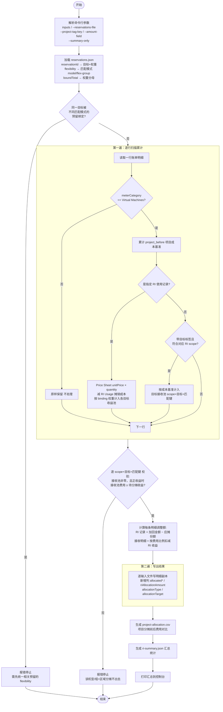
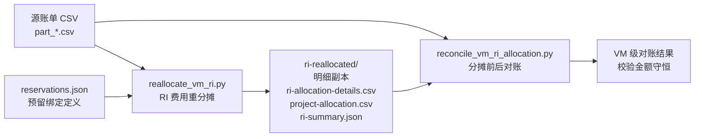
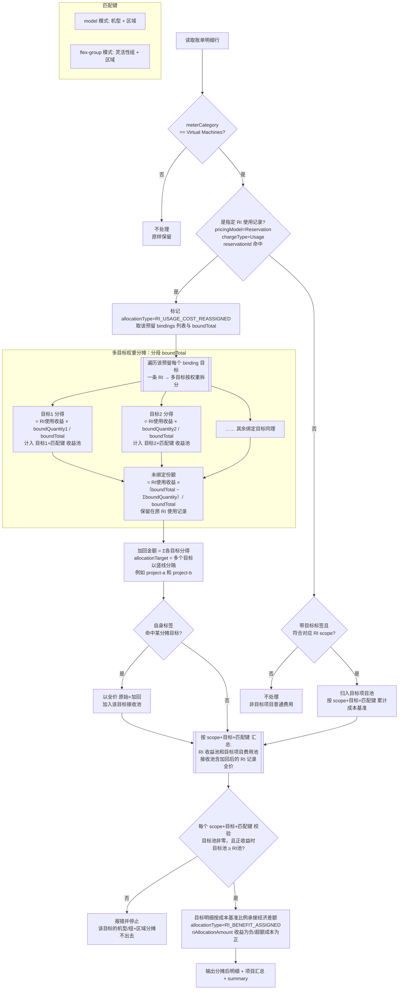

# RI 经济责任重新分摊说明

> **文档元数据**
>
> - 飞书文档（导出目标）：<https://my.feishu.cn/docx/EEQndRbM1occsPxh621c1miSn6b>
> - 说明：本 Markdown 为权威源文件；后续如需同步/导出到飞书，请更新上述飞书文档。
> - 最后导出到飞书：2026-08-28

## 1. 目的

本方案用于生成一份新的 Azure 成本明细副本，将预留（RI）的**实际使用收益或超额成本**按 `reservations.json` 中每个预留 `bindings` 的 `boundQuantity` 权重重新分摊到一个或多个项目，同时保留源文件不变。推荐先运行 `allocate_ri_difference.py` 对齐 Actual 与 Amortized RI 成本，再以调整后成本作为本脚本的成本基准。

原始资源的以下字段保持不变：

- `tags`
- `ResourceId`
- `pricingModel`
- 原始 `costInBillingCurrency`

输出明细新增分摊字段，不覆盖 Azure 原始账单字段。

## 2. RI 使用记录识别规则

同时满足以下条件的记录被识别为实际 RI 使用记录：

```text
pricingModel = Reservation
chargeType = Usage
reservationId = reservations.json 中定义的 reservationId
```

当前脚本只对以下类别进行项目级分摊：

```text
meterCategory = Virtual Machines
```

RI 成本基准由 `--amount-field` 选择：

```text
默认：costInBillingCurrency
Actual/Amortized 差额调整后：costInBillingCurrencyAfterActualReconciliation
```

PAYG 等价成本统一使用 Azure Price Sheet，不读取账单行中的 `paygCostInBillingCurrency`
或同批 OnDemand 行：

```text
RI Usage PAYG 等价成本 = Price Sheet Consumption unitPrice × quantity
RI 使用净收益/损失 = PAYG 等价成本 − RI Usage 成本基准
```

`UnusedReservation` 成本不参与分摊，保留在原账单归属；仅在汇总中展示未使用成本及
“使用净收益/损失 − 未使用成本”的组合净收益，供整体 RI 经济性分析。
Price Sheet 必须与账单的 `meterId`、使用日期和 `billingCurrency` 唯一匹配；缺价、跨币种
或多价格歧义都会报错，不回退到公开零售价。

分摊定义由 `--reservations-file` 指定的预留定义文件（`reservations.json`）提供：
文件中每个预留的 `externalReservationId` 提供待分摊的 `reservationId`，其
`bindings` 按 `boundQuantity` 权重把该 RI 的经济差额分摊到一个或多个项目
（`project`），详见 [6. 执行方法](#6-执行方法)。

RI 收益或超额成本只会分配给符合该 RI `appliedScopeType` / `appliedScopeId`，
并与 RI 使用记录同时匹配以下字段的目标项目明细：

```text
机型 = additionalInfo.ServiceType
区域 = meterRegion（缺失时依次使用 resourceLocation、location）
```

匹配模式由 `reservations.json` 中每个预留的 `flexibility` 字段自动决定，无需命令行指定：`flexibility=on`（开启**实例大小灵活性 Instance Size Flexibility**）时按**灵活性组**匹配（`flex-group`），否则按**精确机型**匹配（`model`）。当某个 RI 开启了实例大小灵活性、可覆盖同一系列的不同规格时，RI 使用记录的机型可能与目标项目实际使用的机型不同（例如 RI 记录为 `Standard_D2s_v5`，而目标项目只跑 `Standard_D4s_v5`）；此时 `model` 会因找不到同规格目标明细而**报错分摊不出去**，而 `flex-group` 按灵活性组匹配即可正常分摊：

```text
组 = 从 additionalInfo.ServiceType 派生的灵活性组（family + 附加特性 + 版本，去掉核数）
     例：Standard_D2s_v5 / Standard_D4s_v5 / Standard_D8-2s_v5 → "Ds_v5"
         Standard_E8s_v5 → "Es_v5"；Standard_D2_v5 → "D_v5"
区域 = meterRegion（缺失时依次使用 resourceLocation、location）
# 机型无法解析时，自动回退到精确机型匹配
```

> `flex-group` 是根据机型名称推导的启发式分组，并非 Azure 官方实例大小灵活性比率表。
> 匹配模式是**按预留（RI）粒度**的：不同预留可各自采用 `flex-group` 或 `model`。若同一 `project` 被匹配模式不同的多个预留同时绑定，收益池无法一致隔离，脚本会报错，需先统一相关预留的 `flexibility`。

## 3. 分摊逻辑

### 3.0 处理流程概览

本节自上而下给出三张图（GitHub 可直接渲染 Mermaid）：先是工具整体执行流程，再是与对账脚本的协作关系，最后是单条明细的判定与分摊流程。

#### 3.0.1 工具整体执行流程（`reallocate_vm_ri.py`）

脚本先把全部输入加载到内存，再分阶段计算 RI 经济差额、累计各
`(RI scope, 分摊目标, 匹配键)` 收益池和接收池，最后按接收池费用比例写出结果。



> `--summary-only` 时不生成账单明细副本和 `ri-allocation-details.csv`，仅生成
> `project-allocation.csv` 与 `ri-summary.json`。

#### 3.0.2 与对账脚本的协作关系

`reconcile_vm_ri_allocation.py` 读取分摊前后两份账单，做虚拟机级别对账，校验金额守恒。



#### 3.0.3 单条明细判定与分摊流程

下图为每条账单明细的判定与分摊流程，并**显式展开**一条 RI 使用记录按 `binding` 权重分摊到多个目标的分叉结构：



> 匹配键由每个预留的 `flexibility` 决定：`model` 用 `(机型, 区域)`，`flex-group`
> 用 `(灵活性组, 区域)`。收益池进一步按 **RI scope** 和**分摊目标**隔离，即实际
> 隔离维度为 `(RI scope, 分摊目标, 匹配键)`；RI 经济差额只在同一 scope、同一
> 目标、同一匹配键内的目标项目明细间按成本基准比例分摊。

### 3.1 RI 使用记录

对每一条 RI 使用记录（无论其自身标签），先根据 Azure Price Sheet 计算该行的 PAYG
等价成本和有符号经济差额，再按该预留的 `bindings` 权重把收益或超额成本拆分到各目标项目。
`UnusedReservation` 成本不参与该过程。拆分分母为 `boundTotal`，每个项目获得
`boundQuantity / boundTotal` 的比例。

```text
RI经济差额 = PAYG等价成本 - RI成本基准
```

结果为正数时表示 RI 收益；结果为负数时表示 RI 成本高于 PAYG 的超额成本。两者使用
同一套有符号分摊公式：正收益降低目标项目费用，超额成本增加目标项目费用。

加回原 RI 使用记录的金额为所有目标项目分得金额之和：

```text
加回金额 = RI经济差额 × ΣboundQuantity / boundTotal
allocatedCostInBillingCurrency = RI成本基准 + 加回金额
```

当 `boundTotal > ΣboundQuantity`（预留只部分绑定）时，未绑定份额 `(boundTotal − ΣboundQuantity) / boundTotal` 对应的收益**不再分摊出去，保留在原 RI 使用记录（即消费该 RI 的项目）上**。

若某条 RI 使用记录自身标签命中某个分摊目标（即消费该 RI 的项目本身就是绑定目标之一），
则加回后它以**全价**（`RI 成本基准 + 加回金额`）参与该目标收益池的分摊，和目标项目
的其他虚拟机明细一起按费用基准比例扣减。这样该项目才能按 binding 权重完整拿到应得
经济差额，而不会因为「自己消费的 RI 记录被排除在接收方之外」而少分。此时该记录的
`riAllocationAmount = 加回金额 − 应摊份额`，净额可正可负。

净调整金额非零的 RI Usage 记录标记为：

```text
allocationType = RI_USAGE_COST_REASSIGNED
allocationTarget = 该预留全部分摊目标（多个时以 | 连接，如 <project-a>|<project-b>）
riAllocationAmount = 加回金额 −（作为接收方时的应摊份额）
```

### 3.2 目标项目明细

接收 RI 收益或超额成本的明细范围为：

```text
meterCategory = Virtual Machines
目标标签 key=value
符合产生该收益池的 RI scope
（含加回后的 RI 使用记录：以全价参与自身所属目标的分摊）
```

经济差额按 `(RI scope, 分摊目标, 机型或灵活性组, 区域)` 分池，只在同一池内的
目标项目明细间按成本基准比例分摊。代码把所有不是“本次选中 RI Usage”的 VM
目标行都作为候选接收行，包括 OnDemand 行、其他 RI Usage 行和其他 VM 费用行；
只有本次选中的 RI Usage 行使用“成本基准 + 加回金额”作为接收基数。

设某一 `(RI scope, 分摊目标, 匹配键)` 池：

```text
RI收益池金额 = 所有 RI 使用记录的经济差额按 boundQuantity 权重分配到该目标、
              且 RI scope 与匹配键（机型或灵活性组 + 区域）一致的贡献之和
目标项目费用总额 = 该池内所有接收明细的费用基数合计
              （其他接收行取成本基准；选中的 RI Usage 取全价 = 成本基准 + 加回金额）
```

每一条明细的分摊金额为：

```text
该行分摊金额
  = RI收益池金额
  × 该行费用基数
  ÷ 目标项目费用总额
```

分摊后的金额为：

```text
allocatedCostInBillingCurrency
  = RI成本基准 - 该行分摊金额
```

正收益场景下：

```text
allocatedCostInBillingCurrency < RI成本基准
```

超额成本场景下符号相反，目标项目的分摊后金额高于成本基准。

净调整金额非零的非 RI 接收记录标记为：

```text
allocationType = RI_BENEFIT_ASSIGNED
allocationTarget = 目标标签值
riAllocationAmount = 负数（收益）或正数（超额成本）
```

### 3.3 金额守恒

分摊前后虚拟机费用总额保持不变：

```text
所有 RI 使用记录加回金额合计
  = 所有目标项目明细扣减金额合计
```

脚本使用 `Decimal` 计算，避免浮点数误差。

## 4. 输出字段

输出明细在原有字段后追加：

| 字段 | 说明 |
|---|---|
| `allocatedCostInBillingCurrency` | 分摊后的账单币种金额 |
| `riAllocationAmount` | 本行有符号调整金额；正收益场景源行为正、目标行为负，超额成本场景相反 |
| `riPaygEquivalentAmount` | RI Usage 按 Azure Price Sheet 计算的 PAYG 等价成本 |
| `riAmortizedCost` | RI Usage 的成本基准；串联执行时为 Actual 对齐后成本 |
| `riBenefitOrLoss` | RI Usage 的有符号净收益/损失；正数为收益，负数为超额成本 |
| `allocationType` | 分摊类型 |
| `allocationTarget` | 分摊目标项目，即目标标签的值 |

经济差额统一按账单币种计算。`--amount-field` 默认为 `costInBillingCurrency`；与
`allocate_ri_difference.py` 串联时应指定
`costInBillingCurrencyAfterActualReconciliation`。此时最终分摊金额仍输出到
`allocatedCostInBillingCurrency`，原始金额和 Actual/Amortized 调整字段均不修改。

逐 RI 的贡献不写入主账单，而是输出到 `ri-allocation-details.csv`。每行只包含一个
`riAllocationReservationIds`，分别记录 RI Usage 恢复金额或某个 RI 对接收行贡献的
收益金额；同一接收行涉及多个 RI 时会生成多条明细。

## 5. 脚本文件

```text
reallocate_vm_ri.py
```

脚本默认不会修改源文件。

## 6. 执行方法

分摊定义由 `--reservations-file` 指定的预留定义文件（`reservations.json`）提供：
**一个 RI 按 `bindings` 的 `boundQuantity` 权重拆分到一个或多个 `project`**。

**文件结构**（数组，或 `{"reservations": [...]}`，或单个对象）：

```json
[
  {
    "externalReservationId": ".../reservationOrders/<reservation-order-id>/reservations/<reservation-id>",
    "appliedScopeType": "Single",
    "appliedScopeId": "/subscriptions/<subscription-id>",
    "flexibility": "on",
    "boundTotal": 3,
    "bindings": [
      {"project": "<project-a>", "boundQuantity": 2},
      {"project": "<project-b>", "boundQuantity": 1}
    ]
  }
]
```

字段说明：

- **reservationId**：优先从 `externalReservationId` 的 `/reservations/` 之后一段
  提取；缺失时回退到 `reservationId` 字段。需与账单 `reservationId` 列一致。
- **flexibility**：实例大小灵活性开关。`on` → 按灵活性组匹配（`flex-group`），
  否则按精确机型匹配（`model`）。匹配模式据此**自动推导，无需命令行参数**。
- **appliedScopeType / appliedScopeId**：RI 优惠范围。`Shared`（或字段缺失）可匹配
  全部输入明细；`Single` 仅匹配 `ResourceId` 位于 `appliedScopeId` 指定订阅或资源组
  下的明细；`ManagementGroup` 优先使用 Azure Python SDK 查询管理组后代订阅，SDK
  返回 403 时改用租户实体层级 API 的 `parentNameChain` 解析，只匹配这些订阅内的明细。
  运行前需执行 `az login`，并确保当前身份有相应的管理组或租户层级读取权限。
- **boundTotal**：预留总份数，作为权重分摊的**分母**。每个项目分得
  `boundQuantity / boundTotal`。缺失、非正或小于 `ΣboundQuantity` 时，回退到以
  `ΣboundQuantity` 为分母（等价于全额分摊）。
- **bindings[].project**：目标项目，映射为目标标签 `<--project-tag-key>=<project>`
  （标签键由 `--project-tag-key` **必填**指定，无默认值）。
- **bindings[].boundQuantity**：该项目的分摊权重（分子）。同一预留内相同
  `project` 的权重合并；权重 ≤ 0 的 binding 忽略；没有有效 binding 的预留跳过。
  如果文件中所有预留都没有有效 binding，脚本会报错。

**分摊规则**：某 RI 的经济差额（按 RI scope 和匹配键分池）按
`boundQuantity / boundTotal` 的
比例拆成子池，每个子池分摊给对应 `project` 目标项目内「符合 RI scope + 相同机型
（或灵活性组）+ 相同区域」的虚拟机明细，并把这些子池金额之和加回各自的 RI 使用记录。
当 `boundTotal > ΣboundQuantity`（预留只部分绑定）时，未绑定份额
`(boundTotal − ΣboundQuantity) / boundTotal` 对应的经济差额**不再分摊，保留在原 RI
使用记录（消费该 RI 的项目）上**。若某条 RI 使用记录自身标签就是绑定目标之一，
则加回后以**全价**（成本基准 + 加回金额）与该目标的其他虚拟机明细一起参与该目标
经济差额分摊，确保该项目按 binding 权重完整承担经济责任；
其净额 `riAllocationAmount = 加回金额 − 应摊份额`，可正可负。金额守恒不变。

多个输入 CSV 的表头必须完全一致。自动下载 Price Sheet 时，输入还必须属于同一
`billingAccountId` 和同一自然月；出现多个账期或计费账户时应分批运行。

在包含源 CSV 的目录执行：

```bash
python3 -m pip install -r requirements.txt

python3 reallocate_vm_ri.py \
  part_0_0001.csv \
  part_1_0001.csv \
  --reservations-file reservations.json \
  --project-tag-key projname \
  --output-dir ri-reallocated
```

### 与 Actual/Amortized 差额调整串联（推荐）

先生成 Actual 对齐后的 Amortized 明细：

```bash
python3 allocate_ri_difference.py \
  --actual "Actual_*.csv" \
  --amortized "Amortized_*.csv" \
  --output-dir ri_reallocated
```

再以调整后成本作为 RI 经济责任分摊基准：

```bash
python3 reallocate_vm_ri.py \
  "ri_reallocated/Amortized_*.csv" \
  --reservations-file reservations.json \
  --project-tag-key projname \
  --amount-field costInBillingCurrencyAfterActualReconciliation \
  --price-sheet-file azure-price-sheet.json \
  --output-dir ri_economic_reallocated
```

最终金额满足：

```text
调整后RI成本 = costInBillingCurrency + riActualAmortizedAdjustment
RI净收益/损失 = PAYG等价成本 - 调整后RI成本
最终项目成本 = 调整后RI成本 + riAllocationAmount
```

当 `PAYG < 调整后RI成本` 时，`riBenefitOrLoss` 和源 RI Usage 行的
`riAllocationAmount` 为负数，目标项目接收行的 `riAllocationAmount` 为正数，
表示将 RI 超额成本从实际消费项目转移给绑定项目。

默认通过 `AzureCliCredential` 使用当前 `az login` 身份下载 Azure Price Sheet。
MCA/MPA 已出账数据按 `invoiceId` 下载；账单包含多个 `invoiceId` 或历史 Usage 行缺少
`invoiceId` 时，通过 `--invoice-id` 显式指定。脚本会把成本导出中的短
`billingAccountId` 自动映射为完整 MCA Billing Account Name，也可用
`--billing-account-name` 显式传入。未出账数据按 billing profile 下载当前月价格表；
EA 按 billing account 和账期下载。Price Sheet 默认最长等待 1800 秒，可通过
`--price-sheet-timeout` 调整：

```bash
python3 reallocate_vm_ri.py \
  "part_*_0001.csv" \
  --reservations-file reservations.json \
  --project-tag-key projname \
  --invoice-id "<invoice-id>" \
  --price-sheet-timeout 1800 \
  --save-price-sheet-file azure-price-sheet.zip \
  --output-dir ri-reallocated
```

也可以显式提供该账期已下载的 Azure Price Sheet（CSV、包含 CSV 的 ZIP，或顶层为
对象数组的 JSON）：

```bash
python3 reallocate_vm_ri.py \
  "part_*_0001.csv" \
  --reservations-file reservations.json \
  --project-tag-key projname \
  --price-sheet-file pricesheet.zip \
  --output-dir ri-reallocated
```

也可以使用 glob：

```bash
python3 reallocate_vm_ri.py \
  "part_*_0001.csv" \
  --reservations-file reservations.json \
  --project-tag-key projname \
  --output-dir ri-reallocated
```

使用其他标签键作为项目匹配条件（`--project-tag-key` 为必填项，无默认值）：

```bash
python3 reallocate_vm_ri.py \
  "part_*_0001.csv" \
  --reservations-file reservations.json \
  --project-tag-key app \
  --output-dir ri-reallocated
```

只生成汇总、不生成账单明细副本及逐 RI 分摊明细：

```bash
python3 reallocate_vm_ri.py \
  "part_*_0001.csv" \
  --reservations-file reservations.json \
  --project-tag-key projname \
  --summary-only \
  --output-dir ri-reallocation-summary
```

> 若某 `project` 在对应 RI scope 内既没有匹配目标标签、机型（或灵活性组）和区域
> 的候选 VM 明细，也没有该目标自身命中的 RI 使用记录，校验会报错——这通常意味着
> binding 的 `project` 与账单标签口径不一致，或输入账单未覆盖对应 scope。

## 7. 输出文件

未使用 `--summary-only` 时，输出目录包含：

```text
ri-reallocated/
├── part_0_0001.csv
├── part_1_0001.csv
├── ri-allocation-details.csv
├── project-allocation.csv
└── ri-summary.json
```

### 明细 CSV

原始明细复制到新文件中，只有新增的分摊字段会体现计算结果；`tags` 和 `ResourceId` 保持原值。

### ri-allocation-details.csv

逐 RI 记录每个源账单行的分摊贡献：

| 字段 | 说明 |
|---|---|
| `sourceFile` | 源账单文件 |
| `sourceRowNumber` | 源账单行号（表头为第 1 行） |
| `ResourceId` | 源账单资源 ID |
| `allocationType` | `RI_USAGE_COST_REASSIGNED`（源 RI Usage 调整）或 `RI_BENEFIT_ASSIGNED`（目标行承接经济差额） |
| `allocationTarget` | 分摊目标项目 |
| `riAllocationReservationIds` | 本条贡献对应的单个 RI ID |
| `allocationAmount` | 此 RI 对源行的有符号贡献；正收益场景源行为正、目标行为负，超额成本场景相反 |

同一源行由多个 RI 贡献时生成多条记录。按 `sourceFile + sourceRowNumber` 汇总
`allocationAmount`，结果等于主账单对应行的 `riAllocationAmount`。

### project-allocation.csv

包含每个项目的 `beforeAmount`、`afterAllocatedAmount`、`delta`、
`riAmountAdded` 和 `riAmountAssigned`。后三个金额均为有符号金额；收益为正时
`riAmountAssigned` 为正，超额成本为负时该字段为负。

> 当前代码为兼容既有下游，首列列名固定为 `projname`；即使
> `--project-tag-key` 使用其他标签键，该列名也不会随之变化。

### ri-summary.json

包含：

- 输入文件、输出文件
- `allocationMode`：分摊模式，固定为 `reservations`（按 binding 权重分摊到一个或多个项目）
- `mappings`：每个 `reservationId` 的分摊目标列表、`matchMode` 及 RI scope
- `matchModeByReservation`：每个 `reservationId` 由 `flexibility` 推导出的匹配模式（`flex-group` / `model`）
- `targets`：全部分摊目标（`key=value` 列表）
- RI 记录数量、RI 分摊记录数量
- `priceSheetSource` / `priceBasis`：Price Sheet 来源及计价公式
- `amountField` / `allocatedCostField`：本次使用的成本基准字段和分摊后金额字段
- `riRawTotalAmount` / `riAmortizedCost`：RI Usage 成本基准合计；使用差额调整字段时
  这里是调整后成本，`riRawTotalAmount` 仅为兼容字段名
- `riPaygEquivalentAmount`：Price Sheet PAYG 等价成本合计
- `riNetBenefitOrLoss`：RI 使用净收益/损失
- `riGrossBenefit`：所有正收益合计
- `riExcessCost`：所有负收益的绝对值合计
- `riUnusedCost`：`UnusedReservation` 成本，仅汇总、不参与分摊
- `riPortfolioNetSavings`：使用净收益/损失减未使用成本，仅用于组合经济性分析
- `riAllocatableAmount`：按 binding 比例实际待分摊的有符号经济差额
- `riSavingsByReservation`：每个 RI 的正收益、超额成本、净收益/损失、未使用成本和组合净收益
- `targetVmReceiverAmount`：目标项目虚拟机接收费用（接收池，含加回后的 RI 记录全价）
- `assignedByTarget`：每个分摊目标承接的有符号经济差额
- `riAllocationKeys`：每个 `(RI scope, 分摊目标, 匹配键)` 的 `riAmount` 与 `targetVmReceiverAmount`
- 源文件是否被修改、标签和资源 ID 是否被修改

## 8. 注意事项

1. 源 CSV 不会被覆盖。
2. 脚本不会修改 `tags` 和 `ResourceId`。
3. 脚本不会把 `pricingModel=Reservation` 改成 `OnDemand`。
4. 如果对应 RI scope 内没有匹配目标标签、机型（或灵活性组）和区域的 VM 接收行，
   脚本会报错；正收益场景下接收池费用小于待分配收益也会报错，避免产生负费用。
   超额成本场景会增加目标项目费用，不受此上限约束。
5. 输出文件中的 `allocatedCostInBillingCurrency` 是基于所选 `--amount-field` 计算的
   分摊分析金额，不是 Azure 原始账单字段。

## 9. 对账脚本

`reconcile_vm_ri_allocation.py` 用于比较原始账单和分摊后账单，按 `ResourceId` 汇总每台虚拟机的处理前费用、处理后费用和变化金额，并补充区域与机型；同时按项目（`projname`）汇总处理前后的 RI 与按需费用。

执行命令：

```bash
python3 reconcile_vm_ri_allocation.py \
  "part_*_0001.csv" \
  --after-dir ri-reallocated \
  --output-dir ri-reallocated
```

示例执行日志（数值均为占位符）：

```text
虚拟机资源数：<resource-count>
费用发生变化的虚拟机数：<changed-resource-count>
处理前合计：<before-total>
处理后合计：<after-total>
变化合计：0
```

对账输出：

```text
ri-reallocated/
├── vm-cost-comparison.csv
├── changed-vm-cost-comparison.csv
└── project-ri-ondemand-comparison.csv
```

其中 `changed-vm-cost-comparison.csv` 仅包含发生费用变化的虚拟机，并包含 `region`、`vmModel`、处理前费用、处理后费用和 `feeChangeInBillingCurrency`。

`project-ri-ondemand-comparison.csv` 按项目（`projname`）汇总处理前后的 RI 与按需费用，含以下列（`pricingModel=Reservation` 计入 RI，其余计入按需；处理前取 `costInBillingCurrency`，处理后取 `allocatedCostInBillingCurrency`）：

```text
projname
beforeRiCostInBillingCurrency
beforeOnDemandCostInBillingCurrency
afterRiCostInBillingCurrency
afterOnDemandCostInBillingCurrency
```

> 当前对账脚本固定读取 `projname` 标签，且处理前固定使用
> `costInBillingCurrency`。因此它适用于 `--project-tag-key projname` 且以原始成本为
> 基准的分摊；若主脚本使用其他项目标签或
> `costInBillingCurrencyAfterActualReconciliation`，该对账脚本的处理前口径不会
> 自动切换，不能直接用于验证调整后成本基准的金额守恒。

## 10. RI 收益项目分布报表

`report_ri_project_distribution.py` 直接读取 `reallocate_vm_ri.py` 的输出目录，
按每个 `reservationId` 展示 RI 净收益/损失在分摊前后的项目分布：

- HTML 头部按“是否有有效 binding”和“本账期是否有实际 Usage”列出四类 RI
  的数量，分类覆盖 `reservations.json` 中全部 RI。
- 后续项目分布只展示有实际 Usage 的前两类；无 Usage 的 RI 不生成空分布区块。
- 分摊前：RI 实际消费资源的项目及其 `riBenefitOrLoss`。
- 分摊后：未绑定而保留在原消费项目的收益，加上分配给各目标项目的收益。
- `reservations.json` 中有实际 Usage、但因没有有效 binding 而未被主脚本纳入分摊的
  RI，也会展示并标记为“未分摊”；其分摊前后项目均为实际消费 RI 的资源项目，
  收益保持不变。账单中存在但 `reservations.json` 完全未定义的 RI 会导致报错。
- 实际使用记录缺少项目标签时，项目名称依次回退到 `resourceGroupName`、
  `subscriptionName`，最后才使用 `<missing>`。
- 每个 RI 的报表头部展示 PAYG 按需等价成本、RI 成本基准和净收益/损失。
- 每个 RI 都会以 `1E-15` 的容差校验分摊前后收益守恒，超出容差时停止并报告差额。

执行命令：

```bash
python3 report_ri_project_distribution.py \
  ri-reallocated \
  --project-tag-key projname \
  --reservations-file reservations.json
```

该报表依赖账单明细副本和 `ri-allocation-details.csv`，因此主脚本不能使用
`--summary-only`。未显式指定 `--reservations-file` 时，报表只会在输入目录及其
上一级目录查找 `reservations.json`。

对于没有主脚本计算字段的未分摊 RI，程序使用分摊汇总中的本地
`priceSheetSource` 计算 PAYG 等价成本；如果汇总记录的是
`Azure Cost Management API` 或本地路径不可访问，必须显式指定：

```bash
python3 report_ri_project_distribution.py \
  ri-reallocated \
  --project-tag-key projname \
  --price-sheet-file azure-price-sheet.json
```

默认输出到 `ri-reallocated/ri-project-distribution/`：

```text
ri-project-distribution/
├── ri-project-distribution.csv
└── ri-project-distribution.html
```

CSV 每行表示一个有实际 Usage 的 RI 在一个项目上的分布，包含 RI 名称、binding
分类、分摊状态、PAYG 按需
等价成本、Actual 差额调整前后的 RI 摊销成本、净收益/损失、分摊前后金额与占比，
以及项目经济责任变化。HTML 的每个 RI 指标区也分别展示差额调整前、调整后摊销成本。
HTML 按 RI 分组，以指标头部、表格和比例条直观对比分摊前后分布，可直接用浏览器打开。