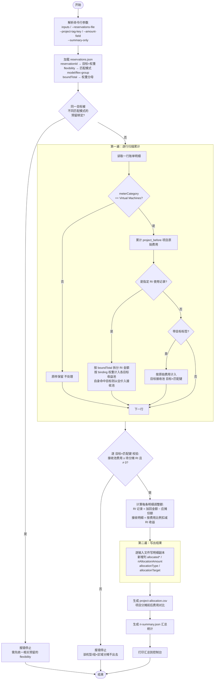
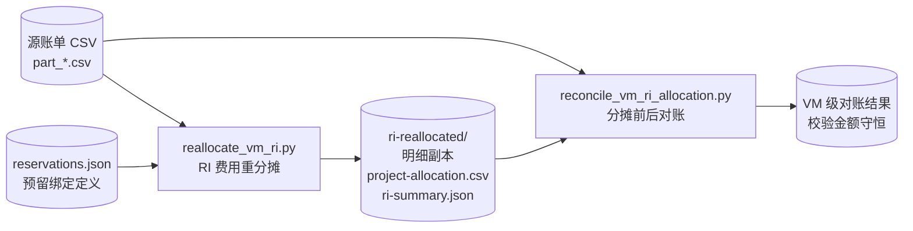

# RI 费用重新分摊说明

> **文档元数据**
>
> - 飞书文档（导出目标）：<https://my.feishu.cn/docx/EEQndRbM1occsPxh621c1miSn6b>
> - 说明：本 Markdown 为权威源文件；后续如需同步/导出到飞书，请更新上述飞书文档。
> - 最后导出到飞书：2026-08-01

## 1. 目的

本方案用于生成一份新的 Azure 成本明细副本，将预留（RI）使用金额按 `reservations.json` 中每个预留 `bindings` 的 `boundQuantity` 权重重新分摊到一个或多个项目，同时保留源文件不变。

原始资源的以下字段保持不变：

- `tags`
- `ResourceId`
- `pricingModel`
- 原始 `costInBillingCurrency`

输出明细新增分摊字段，不覆盖 Azure 原始账单字段。

## 2. RI 使用记录识别规则

同时满足以下条件的记录被识别为实际 RI 使用记录：

```text
pricingModel = Reservation
chargeType = Usage
reservationId = reservations.json 中定义的 reservationId
```

当前脚本只对以下类别进行项目级分摊：

```text
meterCategory = Virtual Machines
```

RI 金额默认使用：

```text
costInBillingCurrency
```

分摊定义由 `--reservations-file` 指定的预留定义文件（`reservations.json`）提供：文件中每个预留的 `externalReservationId` 提供待分摊的 `reservationId`，其 `bindings` 按 `boundQuantity` 权重把该 RI 的优惠收益分摊到一个或多个项目（`projectCode`），详见 [6. 执行方法](#6-执行方法)。

RI 收益只会分配给与 RI 使用记录同时匹配以下字段的目标项目明细：

```text
机型 = additionalInfo.ServiceType
区域 = meterRegion（缺失时依次使用 resourceLocation、location）
```

匹配模式由 `reservations.json` 中每个预留的 `flexibility` 字段自动决定，无需命令行指定：`flexibility=on`（开启**实例大小灵活性 Instance Size Flexibility**）时按**灵活性组**匹配（`flex-group`），否则按**精确机型**匹配（`model`）。当某个 RI 开启了实例大小灵活性、可覆盖同一系列的不同规格时，RI 使用记录的机型可能与目标项目实际使用的机型不同（例如 RI 记录为 `Standard_D2s_v5`，而目标项目只跑 `Standard_D4s_v5`）；此时 `model` 会因找不到同规格目标明细而**报错分摊不出去**，而 `flex-group` 按灵活性组匹配即可正常分摊：

```text
组 = 从 additionalInfo.ServiceType 派生的灵活性组（family + 附加特性 + 版本，去掉核数）
     例：Standard_D2s_v5 / Standard_D4s_v5 / Standard_D8-2s_v5 → "Ds_v5"
         Standard_E8s_v5 → "Es_v5"；Standard_D2_v5 → "D_v5"
区域 = meterRegion（缺失时依次使用 resourceLocation、location）
# 机型无法解析时，自动回退到精确机型匹配
```

> 匹配模式是**按预留（RI）粒度**的：不同预留可各自采用 `flex-group` 或 `model`。若同一 `projectCode` 被匹配模式不同的多个预留同时绑定，收益池无法一致隔离，脚本会报错，需先统一相关预留的 `flexibility`。


## 3. 分摊逻辑

### 3.0 处理流程概览

本节自上而下给出三张图（GitHub 可直接渲染 Mermaid）：先是工具整体执行流程，再是与对账脚本的协作关系，最后是单条明细的判定与分摊流程。

#### 3.0.1 工具整体执行流程（`reallocate_vm_ri.py`）

脚本对全部输入做**两遍扫描**：第一遍逐行累计各项目费用与各 `(分摊目标, 匹配键)` 收益池，第二遍才能按目标项目费用总额算比例并写出结果。



> `--summary-only` 时跳过第二遍的明细副本，仅生成 `project-allocation.csv` 与 `ri-summary.json`。

#### 3.0.2 与对账脚本的协作关系

`reconcile_vm_ri_allocation.py` 读取分摊前后两份账单，做虚拟机级别对账，校验金额守恒。



#### 3.0.3 单条明细判定与分摊流程

下图为每条账单明细的判定与分摊流程，并**显式展开**一条 RI 使用记录按 `binding` 权重分摊到多个目标的分叉结构：

```mermaid
flowchart TD
    A[读取账单明细行] --> B{meterCategory<br/>== Virtual Machines?}
    B -- 否 --> Z[不处理<br/>原样保留]
    B -- 是 --> C{是指定 RI 使用记录?<br/>pricingModel=Reservation<br/>chargeType=Usage<br/>reservationId 命中}

    C -- 是 --> E[标记 allocationType=RI_USAGE_COST_REASSIGNED<br/>取该预留 bindings 列表与 boundTotal]
    E --> SPLIT[[遍历该预留每个 binding 目标<br/>一条 RI → 多目标按权重拆分]]

    subgraph FANOUT[多目标权重分摊：分母 boundTotal]
      direction TB
      SPLIT --> W1[目标1 分得<br/>= RI金额 × boundQuantity1 / boundTotal<br/>计入 目标1+匹配键 收益池]
      SPLIT --> W2[目标2 分得<br/>= RI金额 × boundQuantity2 / boundTotal<br/>计入 目标2+匹配键 收益池]
      SPLIT --> Wd[…… 其余绑定目标同理]
      W1 --> REM
      W2 --> REM
      Wd --> REM[未绑定份额<br/>= RI金额 ×（boundTotal − ΣboundQuantity）/ boundTotal<br/>保留在原 RI 使用记录]
    end

    REM --> LBL[加回金额 = Σ各目标分得<br/>allocationTarget = 全部目标以竖线连接<br/>如 alpha&#124;beta]
    LBL --> SELF{自身标签<br/>命中某分摊目标?}
    SELF -- 是 --> SELFP[以全价 原始+加回<br/>加入该目标接收池]
    SELF -- 否 --> H
    SELFP --> H

    C -- 否 --> F{带目标标签?}
    F -- 否 --> Z3[不处理<br/>非目标项目普通费用]
    F -- 是 --> G[归入目标项目池<br/>按 目标+匹配键 累计原始费用]

    H[[按 目标+匹配键 汇总:<br/>RI 收益池 & 目标项目费用池<br/>接收池含加回后的 RI 记录全价]]
    G --> H
    H --> I{每个 目标+匹配键 校验<br/>目标池 ≥ RI池 且 ≠ 0?}
    I -- 否 --> X[报错并停止<br/>该目标的机型/组+区域分摊不出去]
    I -- 是 --> J[目标明细按原始费用比例扣减 RI 收益<br/>allocationType=RI_BENEFIT_ASSIGNED<br/>riAllocationAmount 为负]
    J --> K[输出分摊后明细 + 项目汇总 + summary]

    subgraph K1[匹配键]
      direction LR
      M1["model 模式: 机型 + 区域"]
      M2["flex-group 模式: 灵活性组 + 区域"]
    end
```



> 匹配键由每个预留的 `flexibility` 决定：`model` 用 `(机型, 区域)`，`flex-group` 用 `(灵活性组, 区域)`。收益池进一步按**分摊目标**隔离，即实际隔离维度为 `(分摊目标, 匹配键)`；RI 收益只在**同一目标、同一匹配键**内的目标项目明细间按原始费用比例分摊。

### 3.1 RI 使用记录

对每一条 RI 使用记录（无论其自身标签），按该预留的 `bindings` 权重把该行的 RI 使用金额拆分到各目标项目。拆分的分母为该预留的 `boundTotal`（预留总份数），每个项目获得 `boundQuantity / boundTotal` 的比例；若 `boundTotal` 缺失或不大于权重合计，则回退到以 `ΣboundQuantity` 为分母（等价于全额分摊）。

加回原 RI 使用记录的金额为所有目标项目分得金额之和：

```text
加回金额 = RI使用金额 × ΣboundQuantity / boundTotal
allocatedCostInBillingCurrency = costInBillingCurrency + 加回金额
```

当 `boundTotal > ΣboundQuantity`（预留只部分绑定）时，未绑定份额 `(boundTotal − ΣboundQuantity) / boundTotal` 对应的收益**不再分摊出去，保留在原 RI 使用记录（即消费该 RI 的项目）上**。

若某条 RI 使用记录自身标签命中某个分摊目标（即消费该 RI 的项目本身就是绑定目标之一），则加回后它以**全价**（`原始金额 + 加回金额`）参与该目标收益池的分摊，和目标项目的普通虚拟机明细一起按费用比例扣减。这样该项目才能按 binding 权重完整拿到应得收益，而不会因为「自己消费的 RI 记录被排除在接收方之外」而少分。此时该记录的 `riAllocationAmount = 加回金额 − 应摊份额`，净额可正可负，但仍统一标记为 `RI_USAGE_COST_REASSIGNED`。

这些记录标记为：

```text
allocationType = RI_USAGE_COST_REASSIGNED
allocationTarget = 该预留全部分摊目标（多个时以 | 连接，如 alpha|beta）
riAllocationAmount = 加回金额 −（作为接收方时的应摊份额）
```

### 3.2 目标项目明细

接收 RI 收益的明细范围为：

```text
meterCategory = Virtual Machines
目标标签 key=value
（含加回后的 RI 使用记录：以全价参与自身所属目标的分摊）
```

RI 收益按 `(分摊目标, 机型或灵活性组, 区域)` 分池，只在同一池内的目标项目明细间按原始虚拟机费用比例分摊，不同目标、机型或区域的虚拟机不会承接该池的 RI 收益。

设某一 `(分摊目标, 匹配键)` 池：

```text
RI收益池金额 = 所有 RI 使用记录按 boundQuantity 权重分配到该目标、
              且匹配键（机型或灵活性组 + 区域）一致的贡献之和
目标项目费用总额 = 该池内所有接收明细的费用基数合计
              （普通非 RI 明细取原始费用；加回后的 RI 使用记录取全价 = 原始金额 + 加回金额）
```

每一条明细的分摊金额为：

```text
该行分摊金额
  = RI收益池金额
  × 该行费用基数
  ÷ 目标项目费用总额
```

分摊后的金额为：

```text
allocatedCostInBillingCurrency
  = costInBillingCurrency - 该行分摊金额
```

因此：

```text
allocatedCostInBillingCurrency < costInBillingCurrency
```

这些记录标记为：

```text
allocationType = RI_BENEFIT_ASSIGNED
allocationTarget = 目标标签值
riAllocationAmount = 负数
```

### 3.3 金额守恒

分摊前后虚拟机费用总额保持不变：

```text
所有 RI 使用记录加回金额合计
  = 所有目标项目明细扣减金额合计
```

脚本使用 `Decimal` 计算，避免浮点数误差。

## 4. 输出字段

输出明细在原有字段后追加：

| 字段 | 说明 |
|---|---|
| `allocated<金额字段>` | 分摊后的计算金额；列名随 `--amount-field` 变化，默认 `allocatedCostInBillingCurrency`，使用 `--amount-field costInUsd` 时为 `allocatedCostInUsd` |
| `riAllocationAmount` | 本行 RI 分摊调整金额，正数为加回，负数为扣减 |
| `allocationType` | 分摊类型 |
| `allocationTarget` | 分摊目标项目，即目标标签的值 |

分摊后金额列的货币与 `--amount-field` 一致；汇总 `ri-summary.json` 的 `allocatedCostField` 字段记录了本次使用的列名。原始金额字段不修改，便于对账。

## 5. 脚本文件

```text
reallocate_vm_ri.py
```

脚本默认不会修改源文件。

## 6. 执行方法

分摊定义由 `--reservations-file` 指定的预留定义文件（`reservations.json`）提供：
**一个 RI 按 `bindings` 的 `boundQuantity` 权重拆分到一个或多个 `projectCode`**。

**文件结构**（数组，或 `{"reservations": [...]}`，或单个对象）：

```json
[
  {
    "externalReservationId": ".../reservationOrders/<order>/reservations/8345b648-839b-4fdc-acbc-a776bdfe00d5",
    "flexibility": "on",
    "boundTotal": 3,
    "bindings": [
      {"projectCode": "config-register-center", "boundQuantity": 2},
      {"projectCode": "observe-platform", "boundQuantity": 1}
    ]
  }
]
```

字段说明：

- **reservationId**：优先从 `externalReservationId` 的 `/reservations/` 之后一段
  提取；缺失时回退到 `reservationId` 字段。需与账单 `reservationId` 列一致。
- **flexibility**：实例大小灵活性开关。`on` → 按灵活性组匹配（`flex-group`），
  否则按精确机型匹配（`model`）。匹配模式据此**自动推导，无需命令行参数**。
- **boundTotal**：预留总份数，作为权重分摊的**分母**。每个项目分得
  `boundQuantity / boundTotal`。缺失、非正或小于 `ΣboundQuantity` 时，回退到以
  `ΣboundQuantity` 为分母（等价于全额分摊）。
- **bindings[].projectCode**：目标项目，映射为目标标签 `projname=<projectCode>`
  （标签键可用 `--project-tag-key` 修改，默认 `projname`）。
- **bindings[].boundQuantity**：该项目的分摊权重（分子）。同一预留内相同
  `projectCode` 的权重合并；权重 ≤ 0 的 binding 忽略；没有有效 binding 的预留跳过。

**分摊规则**：某 RI 的使用金额（按匹配键分池）按 `boundQuantity / boundTotal` 的
比例拆成子池，每个子池分摊给对应 `projectCode` 目标项目内「相同机型（或灵活性组）
+ 相同区域」的虚拟机明细，并把这些子池金额之和加回各自的 RI 使用记录。
当 `boundTotal > ΣboundQuantity`（预留只部分绑定）时，未绑定份额
`(boundTotal − ΣboundQuantity) / boundTotal` 对应的收益**不再分摊，保留在原 RI
使用记录（消费该 RI 的项目）上**。若某条 RI 使用记录自身标签就是绑定目标之一，
则加回后以**全价**（原始金额 + 加回金额）与该目标的普通虚拟机明细一起参与该目标
收益分摊，确保该项目按 binding 权重完整拿到收益（否则可能少于权重应得份额）；
其净额 `riAllocationAmount = 加回金额 − 应摊份额`，可正可负。金额守恒不变。

在包含源 CSV 的目录执行：

```bash
python3 reallocate_vm_ri.py \
  part_0_0001.csv \
  part_1_0001.csv \
  --reservations-file reservations.json \
  --output-dir ri-reallocated
```

也可以使用 glob：

```bash
python3 reallocate_vm_ri.py \
  "part_*_0001.csv" \
  --reservations-file reservations.json \
  --output-dir ri-reallocated
```

指定其他金额字段：

```bash
python3 reallocate_vm_ri.py \
  "part_*_0001.csv" \
  --reservations-file reservations.json \
  --amount-field costInUsd \
  --output-dir ri-reallocated
```

使用其他标签键作为项目匹配条件：

```bash
python3 reallocate_vm_ri.py \
  "part_*_0001.csv" \
  --reservations-file reservations.json \
  --project-tag-key app \
  --output-dir ri-reallocated
```

只生成汇总、不生成明细副本：

```bash
python3 reallocate_vm_ri.py \
  "part_*_0001.csv" \
  --reservations-file reservations.json \
  --summary-only \
  --output-dir ri-reallocation-summary
```

> 若某 `projectCode` 在账单里既没有对应 `projname` 的普通虚拟机明细、也没有该目标
> 自身命中的 RI 使用记录（机型/区域也需匹配），校验会报错——这通常意味着 binding
> 的 projectCode 与账单标签口径不一致，需先对齐命名或改用 `--project-tag-key`。

## 7. 输出文件

执行完成后，输出目录包含：

```text
ri-reallocated/
├── part_0_0001.csv
├── part_1_0001.csv
├── project-allocation.csv
└── ri-summary.json
```

### 明细 CSV

原始明细复制到新文件中，只有新增的分摊字段会体现计算结果；`tags` 和 `ResourceId` 保持原值。

### project-allocation.csv

包含每个项目的：

- 分摊前金额
- 分摊后金额
- 变化金额
- 加回的 RI 金额
- 分配给目标项目的 RI 金额

### ri-summary.json

包含：

- 输入文件、输出文件
- `allocationMode`：分摊模式，固定为 `reservations`（按 binding 权重分摊到一个或多个项目）
- `mappings`：每个 `reservationId` 的分摊目标列表（每个目标含 `key`/`value`/`weight`）及其 `matchMode`
- `matchModeByReservation`：每个 `reservationId` 由 `flexibility` 推导出的匹配模式（`flex-group` / `model`）
- `targets`：全部分摊目标（`key=value` 列表）
- RI 记录数量、RI 分摊记录数量
- `riRawTotalAmount`：RI 使用记录原始费用合计（对账用，未乘权重）
- `riAllocatableAmount`：待分摊 RI 金额（= Σ 加回金额 = 原始费用 × ΣboundQuantity/boundTotal；部分绑定时小于原始费用合计）
- `targetVmReceiverAmount`：目标项目虚拟机接收费用（接收池，含加回后的 RI 记录全价）
- `assignedByTarget`：每个分摊目标承接的 RI 收益总额
- `riAllocationKeys`：每个 `(分摊目标, 匹配键)` 的 `riAmount` 与 `targetVmReceiverAmount`
- 源文件是否被修改、标签和资源 ID 是否被修改

## 8. 注意事项

1. 源 CSV 不会被覆盖。
2. 脚本不会修改 `tags` 和 `ResourceId`。
3. 脚本不会把 `pricingModel=Reservation` 改成 `OnDemand`。
4. 如果目标标签对应项目中既没有匹配机型和区域的普通虚拟机费用、也没有该目标自身命中的 RI 使用记录，或接收池全价费用小于对应 RI 金额，脚本会报错并停止，避免跨规格、跨区域分摊或产生负费用。
5. 输出文件中的 `allocatedCostInBillingCurrency` 是分摊分析金额，不是 Azure 原始账单字段。

## 9. 对账脚本

`reconcile_vm_ri_allocation.py` 用于比较原始账单和分摊后账单，按 `ResourceId` 汇总每台虚拟机的处理前费用、处理后费用和变化金额，并补充区域与机型。

执行命令：

```bash
python3 reconcile_vm_ri_allocation.py \
  "part_*_0001.csv" \
  --after-dir ri-reallocated \
  --output-dir ri-reallocated
```

本次执行日志：

```text
虚拟机资源数：317
费用发生变化的虚拟机数：18
处理前合计：26170.556282735074312
处理后合计：26170.55628273507431200000000
变化合计：0E-23
```

对账输出：

```text
ri-reallocated/
├── vm-cost-comparison.csv
└── changed-vm-cost-comparison.csv
```

其中 `changed-vm-cost-comparison.csv` 仅包含发生费用变化的虚拟机，并包含 `region`、`vmModel`、处理前费用、处理后费用和 `feeChangeInBillingCurrency`。