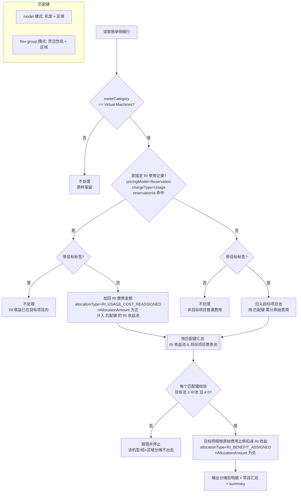

# RI 费用重新分摊说明

## 1. 目的

本方案用于生成一份新的 Azure 成本明细副本，将指定 `reservationId` 的 RI 使用金额重新分摊到指定标签对应的项目，同时保留源文件不变。

原始资源的以下字段保持不变：

- `tags`
- `ResourceId`
- `pricingModel`
- 原始 `costInBillingCurrency`

输出明细新增分摊字段，不覆盖 Azure 原始账单字段。

## 2. RI 使用记录识别规则

同时满足以下条件的记录被识别为实际 RI 使用记录：

```text
pricingModel = Reservation
chargeType = Usage
reservationId = 命令行指定的 reservationId
```

当前脚本只对以下类别进行项目级分摊：

```text
meterCategory = Virtual Machines
```

RI 金额默认使用：

```text
costInBillingCurrency
```

可通过重复指定 `--reservation-id` 同时选择多个 RI；必须通过 `--target-tag key=value` 指定优惠收益接收项目，例如 `--target-tag projname=fota`。此时所有 RI 共用同一个分摊目标。

若需要**为不同 RI 指定不同的分摊目标**（一个 RI 只能有一个目标，不同 RI 可以有不同目标），改用 `--mapping-file` 从外部文件读取 `reservationId → 分摊目标标签` 的映射，详见 [6.1 映射文件模式](#61-映射文件模式多目标)。

RI 收益只会分配给与 RI 使用记录同时匹配以下字段的目标项目明细：

```text
机型 = additionalInfo.ServiceType
区域 = meterRegion（缺失时依次使用 resourceLocation、location）
```

默认按精确机型匹配（`--match-mode model`）。当某个 RI 开启了**实例大小灵活性（Instance Size Flexibility）**、可覆盖同一系列的不同规格时，RI 使用记录的机型可能与目标项目实际使用的机型不同（例如 RI 记录为 `Standard_D2s_v5`，而目标项目只跑 `Standard_D4s_v5`），此时 `model` 模式会因找不到同规格目标明细而**报错分摊不出去**。使用 `--match-mode flex-group` 可改为按**灵活性组**匹配：

```text
组 = 从 additionalInfo.ServiceType 派生的灵活性组（family + 附加特性 + 版本，去掉核数）
     例：Standard_D2s_v5 / Standard_D4s_v5 / Standard_D8-2s_v5 → "Ds_v5"
         Standard_E8s_v5 → "Es_v5"；Standard_D2_v5 → "D_v5"
区域 = meterRegion（缺失时依次使用 resourceLocation、location）
# 机型无法解析时，自动回退到精确机型匹配
```


## 3. 分摊逻辑

### 3.0 处理流程概览

下图为每条账单明细的判定与分摊流程（GitHub 可直接渲染 Mermaid）：



> 匹配键由 `--match-mode` 决定：`model` 用 `(机型, 区域)`，`flex-group` 用 `(灵活性组, 区域)`。使用 `--mapping-file` 指定多目标时，收益池进一步按**分摊目标**隔离，即实际隔离维度为 `(分摊目标, 匹配键)`；RI 收益只在**同一目标、同一匹配键**内的目标项目明细间按原始费用比例分摊。

### 3.1 RI 使用记录

对于不匹配目标标签的 RI 使用记录，将该行的 RI 使用金额加回资源成本：

```text
allocatedCostInBillingCurrency
  = costInBillingCurrency + RI使用金额
```

因此：

```text
allocatedCostInBillingCurrency > costInBillingCurrency
```

这些记录标记为：

```text
allocationType = RI_USAGE_COST_REASSIGNED
allocationTarget = 目标标签值
riAllocationAmount = 正数
```

### 3.2 目标项目明细

目标范围为：

```text
meterCategory = Virtual Machines
目标标签 key=value
且不是实际 RI 使用记录
```

RI 金额按相同机型(或灵活性组)、相同区域的目标项目明细原始虚拟机费用比例分摊，不同机型或区域的虚拟机不会承接该 RI 收益。

设：

```text
RI总金额 = 同一机型(或灵活性组)和区域下所有不匹配目标标签的指定 RI 使用记录金额合计
目标项目非RI虚拟机费用总额 = 同一机型和区域下所有目标项目明细的原始费用合计
```

每一条明细的分摊金额为：

```text
该行分摊金额
  = RI总金额
  × 该行原始费用
  ÷ 目标项目非RI虚拟机费用总额
```

分摊后的金额为：

```text
allocatedCostInBillingCurrency
  = costInBillingCurrency - 该行分摊金额
```

因此：

```text
allocatedCostInBillingCurrency < costInBillingCurrency
```

这些记录标记为：

```text
allocationType = RI_BENEFIT_ASSIGNED
allocationTarget = 目标标签值
riAllocationAmount = 负数
```

### 3.3 金额守恒

分摊前后虚拟机费用总额保持不变：

```text
非目标标签 RI 记录增加金额
  = 相同机型和区域的目标项目明细扣减金额
```

脚本使用 `Decimal` 计算，避免浮点数误差。

## 4. 输出字段

输出明细在原有字段后追加：

| 字段 | 说明 |
|---|---|
| `allocated<金额字段>` | 分摊后的计算金额；列名随 `--amount-field` 变化，默认 `allocatedCostInBillingCurrency`，使用 `--amount-field costInUsd` 时为 `allocatedCostInUsd` |
| `riAllocationAmount` | 本行 RI 分摊调整金额，正数为加回，负数为扣减 |
| `allocationType` | 分摊类型 |
| `allocationTarget` | 分摊目标项目，即目标标签的值 |

分摊后金额列的货币与 `--amount-field` 一致；汇总 `ri-summary.json` 的 `allocatedCostField` 字段记录了本次使用的列名。原始金额字段不修改，便于对账。

## 5. 脚本文件

```text
reallocate_vm_ri.py
```

脚本默认不会修改源文件。

## 6. 执行方法

在包含源 CSV 的目录执行：

```bash
python3 reallocate_vm_ri.py \
  part_0_0001.csv \
  part_1_0001.csv \
  --reservation-id 8345b648-839b-4fdc-acbc-a776bdfe00d5 \
  --target-tag projname=fota \
  --match-mode flex-group \
  --output-dir ri-reallocated
```

也可以使用 glob：

```bash
python3 reallocate_vm_ri.py \
  "part_*_0001.csv" \
  --reservation-id 8345b648-839b-4fdc-acbc-a776bdfe00d5 \
  --target-tag projname=fota \
  --match-mode flex-group \
  --output-dir ri-reallocated
```

指定多个 RI：

```bash
python3 reallocate_vm_ri.py \
  part_0_0001.csv \
  part_1_0001.csv \
  --reservation-id ri-id-1 \
  --reservation-id ri-id-2 \
  --target-tag projname=fota \
  --match-mode flex-group \
  --output-dir ri-reallocated
```

使用其他标签作为接收项目条件：

```bash
python3 reallocate_vm_ri.py \
  part_0_0001.csv \
  part_1_0001.csv \
  --reservation-id 8345b648-839b-4fdc-acbc-a776bdfe00d5 \
  --target-tag app=nacos \
  --output-dir ri-reallocated
```

指定其他金额字段：

```bash
python3 reallocate_vm_ri.py \
  part_0_0001.csv \
  part_1_0001.csv \
  --reservation-id 8345b648-839b-4fdc-acbc-a776bdfe00d5 \
  --target-tag projname=fota \
  --amount-field costInUsd \
  --output-dir ri-reallocated
```

只生成汇总、不生成明细副本：

```bash
python3 reallocate_vm_ri.py \
  part_0_0001.csv \
  part_1_0001.csv \
  --reservation-id 8345b648-839b-4fdc-acbc-a776bdfe00d5 \
  --target-tag projname=fota \
  --summary-only \
  --output-dir ri-reallocation-summary
```

### 6.1 映射文件模式（多目标）

当不同 RI 需要分摊给不同项目时，使用 `--mapping-file` 从外部文件读取
`reservationId → 分摊目标标签` 的映射。约束：**一个 RI 只能有一个分摊目标，
不同 RI 可以有不同目标**（映射文件中同一 reservationId 出现多个不同目标会报错）。

`--mapping-file` 与 `--reservation-id` / `--target-tag` 互斥，提供映射文件后
后两者不再需要。

支持 JSON 和 CSV 两种格式（按扩展名判断，`.csv` 走 CSV，其余按 JSON）：

**JSON 对象形式**（最简洁，键为 reservationId，值为 `key=value`）：

```json
{
  "8345b648-839b-4fdc-acbc-a776bdfe00d5": "projname=fota",
  "1f2e3d4c-5b6a-7890-abcd-ef1234567890": "projname=beta"
}
```

**JSON 结构化形式**（`targetTag` 支持 `key=value` 字符串或 `{"key":..,"value":..}` 对象）：

```json
{
  "mappings": [
    {"reservationId": "8345b648-839b-4fdc-acbc-a776bdfe00d5", "targetTag": "projname=fota"},
    {"reservationId": "1f2e3d4c-5b6a-7890-abcd-ef1234567890", "targetTag": {"key": "app", "value": "nacos"}}
  ]
}
```

**CSV 形式**（需包含 `reservationId` 和 `targetTag` 两列）：

```csv
reservationId,targetTag
8345b648-839b-4fdc-acbc-a776bdfe00d5,projname=fota
1f2e3d4c-5b6a-7890-abcd-ef1234567890,projname=beta
```

执行：

```bash
python3 reallocate_vm_ri.py \
  "part_*_0001.csv" \
  --mapping-file ri-target-mapping.json \
  --match-mode flex-group \
  --output-dir ri-reallocated
```

**收益隔离**：每个 RI 的优惠收益只会分摊给它自己映射的目标项目，且仍受
「相同机型（或灵活性组）+ 相同区域」匹配键约束。不同目标之间互不串收益——
即使两个目标恰好使用同机型同区域，RI-A 的收益也不会流向 RI-B 的目标。校验
（目标非 RI 费用 ≥ 待分摊 RI 金额、且不为 0）按 `(分摊目标, 匹配键)` 逐一进行。

### 6.2 预留定义模式（一个 RI 按 binding 分摊到多个项目）

当**一个 RI 需要同时分摊给多个项目**时，使用 `--reservations-file` 从预留
定义文件（`reservations.json`）读取分摊比例。与 6.1 的区别：6.1 是「一个 RI
一个目标」，本模式是「一个 RI 按 `bindings` 的 `boundQuantity` 权重拆分到多个
`projectCode`」。

`--reservations-file` 与 `--mapping-file` / `--reservation-id` / `--target-tag`
互斥。

**文件结构**（数组，或 `{"reservations": [...]}`，或单个对象）：

```json
[
  {
    "externalReservationId": ".../reservationOrders/<order>/reservations/8345b648-839b-4fdc-acbc-a776bdfe00d5",
    "bindings": [
      {"projectCode": "config-register-center", "boundQuantity": 2},
      {"projectCode": "observe-platform", "boundQuantity": 1}
    ]
  }
]
```

字段说明：

- **reservationId**：优先取 `reservationId` 字段；缺失时从 `externalReservationId`
  的 `/reservations/` 之后一段提取。需与账单 `reservationId` 列一致。
- **bindings[].projectCode**：目标项目，映射为目标标签 `projname=<projectCode>`
  （标签键可用 `--project-tag-key` 修改，默认 `projname`）。
- **bindings[].boundQuantity**：该项目的分摊权重。同一预留内相同 `projectCode`
  的权重合并；权重 ≤ 0 的 binding 忽略；没有有效 binding 的预留跳过。

**分摊规则**：某 RI 的全部使用金额（按匹配键分池）先加回各自的 RI 使用记录，
再按 `boundQuantity / ΣboundQuantity` 的比例拆成子池，每个子池分摊给对应
`projectCode` 目标项目内「相同机型（或灵活性组）+ 相同区域」的非 RI 虚拟机明细。
与 6.1 不同，本模式对**全部** RI 使用记录加回并按权重再分摊（即使某条 RI 使用
记录本就落在某个绑定项目内），从而严格按 binding 比例分配收益。金额守恒不变。

执行：

```bash
python3 reallocate_vm_ri.py \
  "part_*_0001.csv" \
  --reservations-file reservations.json \
  --amount-field costInUsd \
  --output-dir ri-reallocated
```

> 若某 `projectCode` 在账单里没有对应 `projname` 的非 RI 虚拟机明细（机型/区域
> 也需匹配），校验会报错——这通常意味着 binding 的 projectCode 与账单标签口径
> 不一致，需先对齐命名或改用 `--project-tag-key`。

## 7. 输出文件

执行完成后，输出目录包含：

```text
ri-reallocated/
├── part_0_0001.csv
├── part_1_0001.csv
├── project-allocation.csv
└── ri-summary.json
```

### 明细 CSV

原始明细复制到新文件中，只有新增的分摊字段会体现计算结果；`tags` 和 `ResourceId` 保持原值。

### project-allocation.csv

包含每个项目的：

- 分摊前金额
- 分摊后金额
- 变化金额
- 加回的 RI 金额
- 分配给目标项目的 RI 金额

### ri-summary.json

包含：

- 输入文件、输出文件
- `allocationMode`：分摊模式，`mapping`（单目标/映射文件/内联）或 `reservations`（按 binding 权重多目标）
- `mappings`：每个 `reservationId` 的分摊目标列表，每个目标含 `key`/`value`/`weight`
- `targets`：全部分摊目标（`key=value` 列表）
- RI 记录数量、RI 分摊记录数量
- RI 金额、目标项目非 RI 虚拟机费用
- `assignedByTarget`：每个分摊目标承接的 RI 收益总额
- `riAllocationKeys`：每个 `(分摊目标, 匹配键)` 的 RI 金额与目标费用
- 源文件是否被修改、标签和资源 ID 是否被修改

## 8. 注意事项

1. 源 CSV 不会被覆盖。
2. 脚本不会修改 `tags` 和 `ResourceId`。
3. 脚本不会把 `pricingModel=Reservation` 改成 `OnDemand`。
4. 如果目标标签对应项目中没有匹配机型和区域的非 RI 虚拟机费用，或费用小于对应 RI 金额，脚本会报错并停止，避免跨规格、跨区域分摊或产生负费用。
5. 输出文件中的 `allocatedCostInBillingCurrency` 是分摊分析金额，不是 Azure 原始账单字段。

## 9. 对账脚本

`reconcile_vm_ri_allocation.py` 用于比较原始账单和分摊后账单，按 `ResourceId` 汇总每台虚拟机的处理前费用、处理后费用和变化金额，并补充区域与机型。

执行命令：

```bash
python3 reconcile_vm_ri_allocation.py \
  "part_*_0001.csv" \
  --after-dir ri-reallocated \
  --output-dir ri-reallocated
```

本次执行日志：

```text
虚拟机资源数：317
费用发生变化的虚拟机数：18
处理前合计：26170.556282735074312
处理后合计：26170.55628273507431200000000
变化合计：0E-23
```

对账输出：

```text
ri-reallocated/
├── vm-cost-comparison.csv
└── changed-vm-cost-comparison.csv
```

其中 `changed-vm-cost-comparison.csv` 仅包含发生费用变化的虚拟机，并包含 `region`、`vmModel`、处理前费用、处理后费用和 `feeChangeInBillingCurrency`。